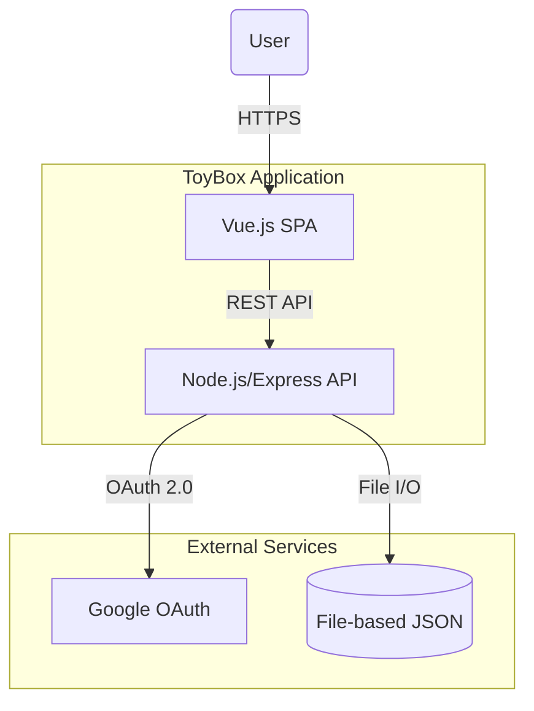
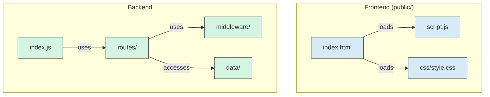
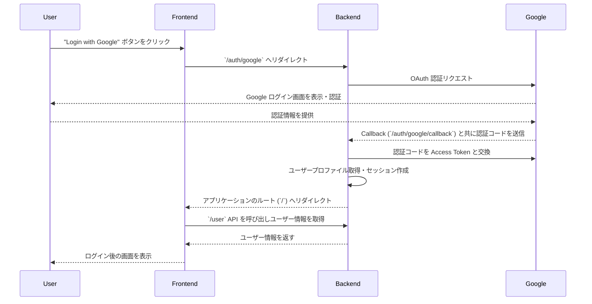
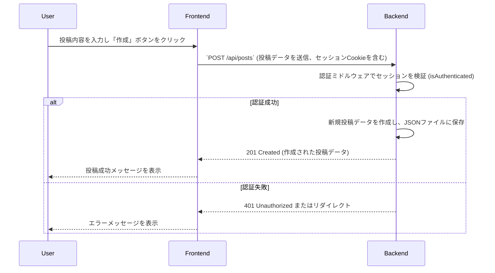

# 設計文書 (DESIGN.md)

## 1. はじめに

この文書は、`ToyBox` プロジェクトのソフトウェアアーキテクチャを arc42 テンプレートを参考にして記述したものです。

### 1.1. プロジェクトの目的

このプロジェクトは、モダンで標準的な技術スタックを用いた Web アプリケーション開発のひな形となるサンプルを提供することを目的としています。主な機能として、ユーザー認証とブログ投稿（閲覧・作成・削除）機能を実装します。

### 1.2. 品質目標

- **保守性:** コンポーネント間の依存関係を疎に保ち、機能追加や変更が容易であること。
- **ポータビリティ:** オープンな技術を主に利用し、特定のクラウドベンダーへの依存を最小限に抑えること。
- **費用対効果:** 個人開発者が低コストで運用できる構成であること。
- **セキュリティ:** 一般的な Web アプリケーションに求められる基本的なセキュリティ要件を満たすこと。

## 2. 制約

- **禁止技術:** React, Firebase
- **クラウドプロバイダー:** Google Cloud を主要なターゲットとするが、強い依存は避ける。
- **開発言語:** フロントエンドは HTML/CSS/JavaScript (Vue.js)、バックエンドは Node.js とする。

## 3. スコープとコンテキスト

### 3.1. ビジネスコンテキスト

このアプリケーションは、ブログ記事を管理するためのシンプルなプラットフォームを提供します。ユーザーは Google アカウントで認証し、自身の記事を作成、閲覧、削除できます。

### 3.2. 技術的コンテキスト

## 4. 解決策の戦略

- **アーキテクチャ:** フロントエンド (SPA) とバックエンド (REST API) を分離した構成とします。
- **認証:** Google OAuth 2.0 を利用したセッションベースの認証を採用します。`passport` と `express-session` を利用し、堅牢な認証を外部サービスに委任します。
- **データ永続化:** 開発初期段階ではファイルベースの JSON をデータストアとして利用し、迅速な開発を可能にします。将来的には、より堅牢なデータベースへの移行を想定しています。
- **デプロイ:** アプリケーション全体をコンテナ化し、Google Cloud Run などのコンテナ実行環境へのデプロイを容易にします。

## 5. ビルディングブロックビュー (コンポーネント分割)

### 5.1. レベル1: ホワイトボックス

### 5.2. コンポーネントの責務

- **Frontend (`public/`)**: クライアントサイドのレンダリングとユーザーインタラクションを担当する SPA。
  - `index.html`: アプリケーションのエントリーポイント。
  - `script.js`: バックエンド API との通信、DOM 操作を担当。
- **Backend**: サーバーサイドのロジック、API 提供、認証を担当。
  - `index.js`: Express サーバーのセットアップ、**セッション管理**、**Passport (Google OAuth) の初期化**、静的ファイル配信、ルーティングの統合。
  - `routes/`: 各 API エンドポイントの定義。
    - `api.js`: `/api` 以下のルーティングを束ねる。
    - `posts.js`: 投稿の CRUD 処理。**（注意: 現在の実装では投稿作成・削除に `middleware/auth.js` を使用しているが、これはJWT用でありセッション認証に修正が必要）**
    - `auth.js`: **（注意: 現状の実装ではJWT用の登録・ログインAPIが定義されているが、Google OAuth認証では使用されないため、このファイルは現状デッドコードとなっている）**
  - `middleware/`: Express のミドルウェア。
    - `auth.js`: **（注意: JWTを検証するミドルウェア。セッションベースの認証チェック機能に置き換える必要がある）**
  - `data/`: データを永続化する JSON ファイル。

## 6. ランタイムビュー (実行時シナリオ)

### 6.1. ユーザー認証フロー

### 6.2. 投稿作成フロー (修正後)

## 7. デプロイメントビュー

- **コンテナ化**: `Dockerfile` を用いて、Node.js アプリケーションを内包したコンテナイメージをビルドします。
- **CI/CD**: `cloudbuild.yaml` を使用し、Google Cloud Build でコンテナイメージのビルドと Google Artifact Registry へのプッシュを自動化します。
- **デプロイ先**: Google Cloud Run を想定しています。

## 8. 横断的なコンセプト

### 8.1. 認証・認可
- **認証 (Authentication):** `passport` と `express-session` を用いたGoogle OAuth 2.0によるセッションベース認証。認証されたユーザー情報はセッションに保存されます。
- **認可 (Authorization):** 保護されたAPIエンドポイントには、リクエストが認証済みセッションを持つか検証するミドルウェア (`isAuthenticated`) を適用します。投稿の削除など、リソースの所有者のみが操作できるように、API側で所有者チェックを実装する必要があります。

### 8.2. 設定管理
- `dotenv` ライブラリを使用し、環境変数 (`.env` ファイル) から設定を読み込みます。これにより、機密情報（APIキー、セッションシークレット等）をコードから分離します。

### 8.3. エラーハンドリング
- **API:** REST APIは、処理結果に応じて適切なHTTPステータスコードを返却します。クライアントエラー（4xx系）やサーバーエラー（5xx系）には、エラー内容を示すJSONオブジェクトを含めることを基本方針とします。
- **サーバー:** Expressのデフォルトエラーハンドリングに加え、必要に応じてカスタムエラーハンドリングミドルウェアを導入します。

## 9. 設計決定

- **認証方式**: JWT ではなく、サーバーサイドでセッションを管理する Google OAuth を採用。クライアント側でのトークン管理が不要になり、実装がシンプルになるため。
- **フレームワーク**: フロントエンドには Vue.js、バックエンドには Express を採用。`GEMINI.md` の方針に従う。
- **データベース**: 初期段階ではファイルベースの JSON を採用。セットアップが不要で、開発初期のプロトタイピングを迅速化するため。

## 10. 品質要求

- **テスト**: バックエンドのAPIエンドポイントについては、JestやMochaなどのフレームワークを用いた単体テスト・結合テストを実装し、CIパイプラインに組み込む必要があります。
- **静的解析**: コード品質と一貫性を維持するため、ESLintを導入し、CIパイプラインで実行します。

## 11. リスクと技術的負債

- **認証ロジックの不整合:**
  - `routes/posts.js` はJWT用の `auth` ミドルウェアに依存していますが、認証方式はセッションベースです。これを `isAuthenticated` のようなセッションチェック処理に置き換える必要があります。
  - `routes/auth.js` は現在使用されていないJWT関連のコードであり、混乱を避けるために削除またはリファクタリングが必要です。
- **データストアの拡張性:**
  - ファイルベースのJSONデータベースは、同時書き込みに対応しておらず、パフォーマンスやデータ整合性の観点から本番運用には適していません。早期にCloud SQLなどのマネージドデータベースへの移行計画を立てる必要があります。
- **フロントエンドの不在:**
  - 現在のフロントエンドはAPIテスターの域を出ていません。`GEMINI.md`の要件であるVue.jsを用いたSPAとして本格的に実装する必要があります。
