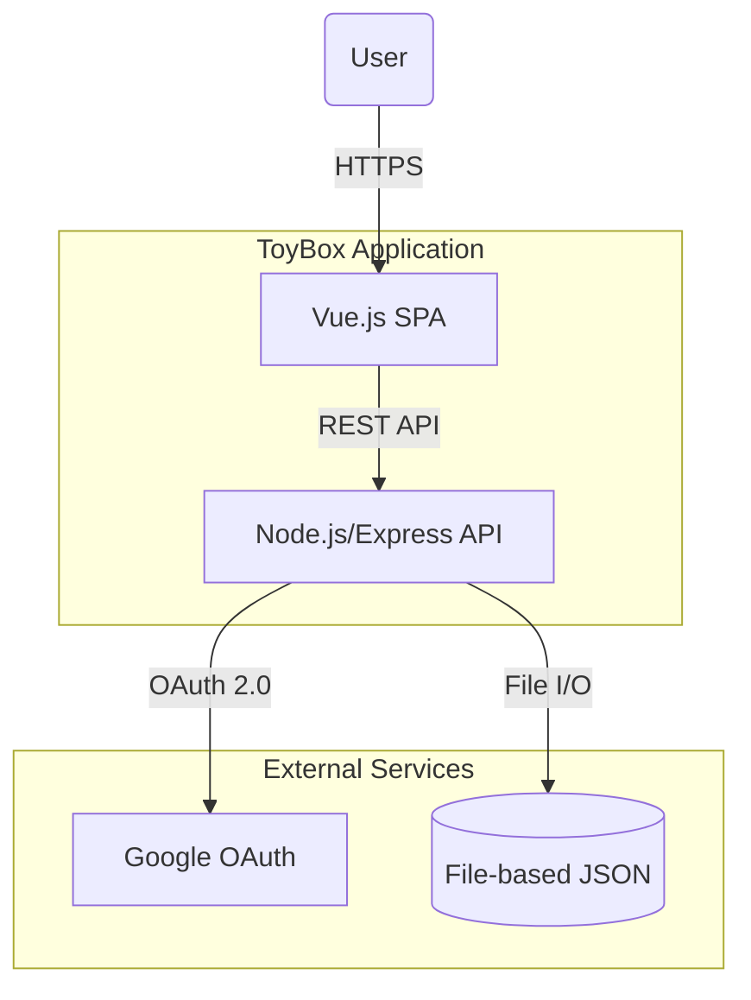
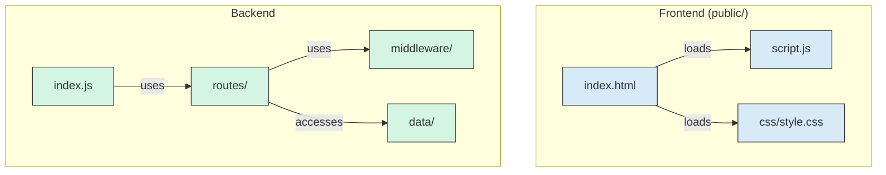
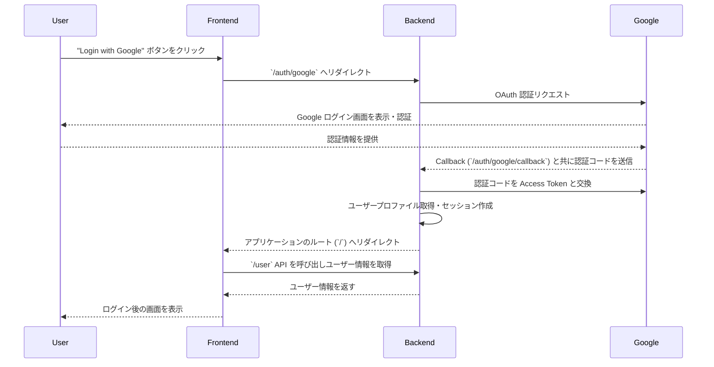

# 設計文書 (DESIGN.md)

## 1. はじめに

この文書は、`ToyBox` プロジェクトのソフトウェアアーキテクチャを arc42 テンプレートを参考にして記述したものです。

### 1.1. プロジェクトの目的

このプロジェクトは、モダンで標準的な技術スタックを用いた Web アプリケーション開発のひな形となるサンプルを提供することを目的としています。

### 1.2. 品質目標

- **保守性:** コンポーネント間の依存関係を疎に保ち、機能追加や変更が容易であること。
- **ポータビリティ:** オープンな技術を主に利用し、特定のクラウドベンダーへの依存を最小限に抑えること。
- **費用対効果:** 個人開発者が低コストで運用できる構成であること。
- **セキュリティ:** 一般的な Web アプリケーションに求められる基本的なセキュリティ要件を満たすこと。

## 2. 制約

- **禁止技術:** React, Firebase
- **クラウドプロバイダー:** Google Cloud を主要なターゲットとするが、強い依存は避ける。
- **開発言語:** フロントエンドは HTML/CSS/JavaScript (Vue.js)、バックエンドは Node.js とする。

## 3. スコープとコンテキスト

### 3.1. ビジネスコンテキスト
このプロジェクトは、個人開発者や小規模チームが、モダンなWebアプリケーションを迅速に開発開始（ブートストラップ）するためのテンプレートを提供することを目的としています。

特定のベンダーにロックインされる高価なサービスよりも、標準的でオープンな技術の組み合わせを優先します。これにより、個人や小規模な商用プロジェクトを開始する際の、初期開発の摩擦と運用コストを低減することがビジネス上のゴールです。

### 3.2. 技術的コンテキスト

## 4. 解決策の戦略

- **アーキテクチャ:** フロントエンド (SPA) とバックエンド (REST API) を分離した構成とします。
- **認証:** Google OAuth 2.0 を利用したセッションベースの認証を採用します。`passport` と `express-session` を利用し、堅牢な認証を外部サービスに委任します。
- **データ永続化:** 開発初期段階ではファイルベースの JSON をデータストアとして利用し、迅速な開発を可能にします。将来的には、より堅牢なデータベースへの移行を想定しています。
- **デプロイ:** アプリケーション全体をコンテナ化し、Google Cloud Run などのコンテナ実行環境へのデプロイを容易にします。

## 5. ビルディングブロックビュー (コンポーネント分割)

### 5.1. レベル1: ホワイトボックス

### 5.2. コンポーネントの責務

- **Frontend (`public/`)**: クライアントサイドのレンダリングとユーザーインタラクションを担当する SPA。
  - `index.html`: アプリケーションのエントリーポイント。
  - `script.js`: バックエンド API との通信、DOM 操作を担当。
- **Backend**: サーバーサイドのロジック、API 提供、認証を担当。
  - `index.js`: Express サーバーのセットアップ、ミドルウェアの全体適用、ルーティングの統合。
  - `routes/`: 各 API エンドポイントの定義。
    - `api.js`: `/api` 以下のルーティングを束ねる。
    - `posts.js`: (新規) 投稿関連のAPIルート (`/api/posts`) を担当。
  - `middleware/`: Express のミドルウェア。
    - `auth.js`: (新規) 認証ミドルウェア (`isAuthenticated`) を担当。
    - `requestLogger.js`: (新規) リクエスト単位でログを収集・管理するミドルウェアを担当。
  - `lib/`: 再利用可能なビジネスロジック。
    - `posts.js`: (新規) `data/posts.json` への読み書きをカプセル化するデータアクセス層。
  - `data/`: データを永続化する JSON ファイル。

## 6. ランタイムビュー (実行時シナリオ)

### 6.1. ユーザー認証フロー

## 7. デプロイメントビュー

- **コンテナ化**: `Dockerfile` を用いて、Node.js アプリケーションを内包したコンテナイメージをビルドします。
- **CI/CD**: `cloudbuild.yaml` を使用し、Google Cloud Build でコンテナイメージのビルドと Google Artifact Registry へのプッシュを自動化します。
- **デプロイ先**: Google Cloud Run を想定しています。

## 8. 横断的なコンセプト

### 8.1. 認証・認可
- **認証 (Authentication):** `passport` と `express-session` を用いたGoogle OAuth 2.0によるセッションベース認証。認証されたユーザー情報はセッションに保存されます。
- **認可 (Authorization):** 保護されたAPIエンドポイントには、リクエストが認証済みセッションを持つか検証するミドルウェア (`isAuthenticated`) を適用します。投稿の削除など、リソースの所有者のみが操作できるように、API側で所有者チェックを実装する必要があります。

### 8.2. 設定管理
- `dotenv` ライブラリを使用し、環境変数 (`.env` ファイル) から設定を読み込みます。これにより、機密情報（APIキー、セッションシークレット等）をコードから分離します。

### 8.3. エラーハンドリング
- **API:** REST APIは、処理結果に応じて適切なHTTPステータスコードを返却します。クライアントエラー（4xx系）やサーバーエラー（5xx系）には、エラー内容を示すJSONオブジェクトを含めることを基本方針とします。
- **サーバー:** Expressのデフォルトエラーハンドリングに加え、必要に応じてカスタムエラーハンドリングミドルウェアを導入します。

### 8.4. デバッグログの転送 (Debug Log Transfer)
開発モード (`NODE_ENV !== 'production'`) でAPIが実行された場合、そのリクエスト処理中にバックエンドで発生したデバッグログは、レスポンスの一部としてフロントエンドに転送されます。

- **実装方針:**
  - Node.js の `AsyncLocalStorage` を利用して、リクエストごとに一意のストレージ（コンテキスト）を作成します。
  - リクエストの開始時に、ログメッセージを保持するための配列をコンテキスト内にセットするミドルウェア (`requestLogger.js`) を導入します。
  - アプリケーション内のどこからでも、現在のリクエストのコンテキストにアクセスしてログを追記できるロガーユーティリティを実装します。
  - APIがレスポンスを返す直前で、コンテキストからログ配列を取得し、JSONボディの `_debug` フィールドに挿入します。

### 8.5. 実行環境管理 (Execution Environment Management)
本アプリケーションは、`NODE_ENV` 環境変数によって制御される2つの主要な実行モードを持ちます。

- **`development` モード:**
  - 開発時のためのモードです。
  - `express-session` の `cookie.secure` が `false` に設定され、HTTP経由でのセッションが許可されます。
  - 「8.4. デバッグログの転送」で定義された、詳細なデバッグログがAPIレスポンスに含まれます。

- **`production` モード:**
  - 本番環境のためのモードです。
  - `express-session` の `cookie.secure` が `true` に設定され、CookieがHTTPS経由でのみ送信されるようになります。
  - パフォーマンスとセキュリティのため、デバッグログはコンソールにもAPIレスポンスにも出力されません。

これらのモードは、`package.json` の `scripts` セクションで `cross-env` パッケージを用いて設定されます。これにより、Windows, macOS, Linuxといった異なるOS間でも、環境変数を設定する際の互換性が保証されます。

## 9. 設計決定

- **認証方式**: JWT ではなく、サーバーサイドでセッションを管理する Google OAuth を採用。クライアント側でのトークン管理が不要になり、実装がシンプルになるため。
- **フレームワーク**: フロントエンドには Vue.js、バックエンドには Express を採用。`GEMINI.md` の方針に従う。
- **データベース**: 初期段階ではファイルベースの JSON を採用。セットアップが不要で、開発初期のプロトタイピングを迅速化するため。

## 10. 品質要求

- **テスト**: バックエンドのAPIエンドポイントについては、JestやMochaなどのフレームワークを用いた単体テスト・結合テストを実装し、CIパイプラインに組み込む必要があります。
- **静的解析**: コード品質と一貫性を維持するため、ESLintを導入し、CIパイプラインで実行します。

## 11. リスクと技術的負債
- **リスク: データ永続化のスケーラビリティ**
  - 現在のファイルベースのJSONデータベースは、複数の同時書き込みに対応しておらず、競合が発生する可能性があります。
  - アプリケーションの利用者が増えた場合、パフォーマンスのボトルネックとなり、単一障害点にもなります。本番運用を見据える場合は、より堅牢なデータベース（例: PostgreSQL, Firestoreなど）への移行が必須です。
  - **解決策案:**
    - データストアをGoogle Cloud Firestore (Nativeモード) に移行する。
    - その際、データベースへのアクセス処理は `lib/posts.js` のようなデータアクセス層に完全にカプセル化する。これにより、将来他のデータベース（例: MongoDB）へ再移行する際の影響を最小限に抑える。

- **技術的負債: 自動テストの欠如**
  - 「10. 品質要求」で言及されている通り、APIエンドポイントに対する単体テスト・結合テストが実装されていません。
  - 今後機能追加やリファクタリングを行う際に、既存の機能を破壊（デグレード）してしまうリスクが高まっています。
  - **解決策案:**
    - テストフレームワークとしてJestを、API結合テストツールとしてSupertestを導入する。
    - CI/CDパイプラインにテスト実行を組み込み、コード品質を継続的に担保する。

- **技術的負債: フロントエンドのモノリシックな構造**
  - 現在のフロントエンドは単一の `script.js` ファイルで構成されています。
  - 今後、`SPEC.md`で要求されている一般ユーザー向けUIと開発者向けUIを実装していくにあたり、コンポーネント分割などの適切な構造化を行わない限り、保守性が著しく低下します。
  - **解決策案:**
    - Vue.jsを本格導入し、フロントエンドをコンポーントベースで再構築する。
    - `public/components/` ディレクトリを作成し、`UserView.js`（一般ユーザー向けUI）や `DevView.js`（開発者向けUI）といった単位でコンポーネントファイルを分割する。
