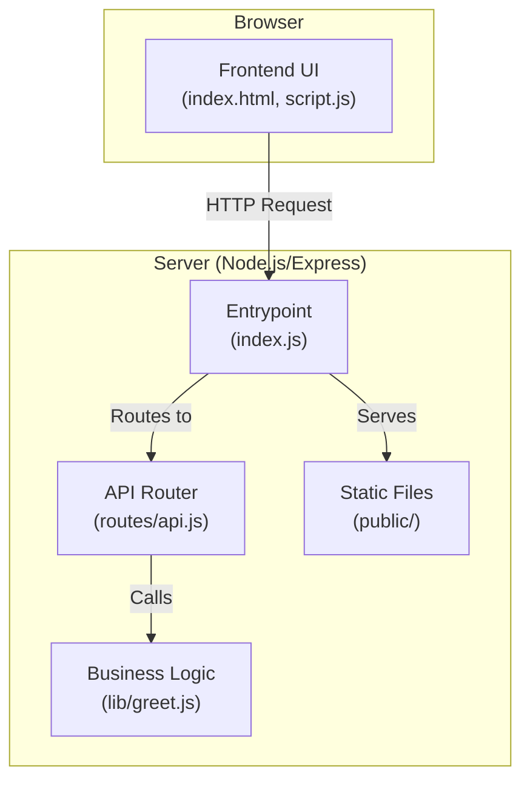
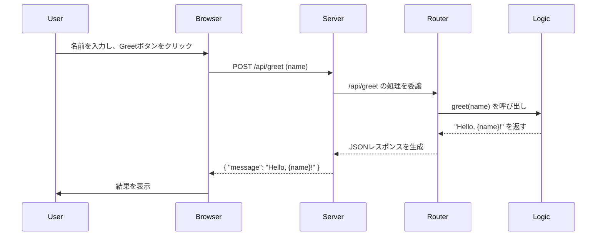

# ToyBox Project

## 概要

このプロジェクトは、モダンで標準的な技術スタックを用いた Web アプリケーションのベース（ひな形）です。REST API サーバー、静的ファイル配信、コンテナ化など、基本的な要素を含んでいます。

## 1. アプリケーション仕様

### 1.1. 外部要求仕様

このアプリケーションは、以下の API エンドポイントとフロントエンド UI を提供します。

#### API エンドポイント

| Method | Path          | Request Body           | Response Body (Success)                      | Description                            |
| :----- | :------------ | :--------------------- | :------------------------------------------- | :------------------------------------- |
| `POST` | `/api/greet`  | `{ "name": "string" }` | `{ "message": "Hello, {name}!" }`            | 指定された名前に対して挨拶を返します。 |
| `GET`  | `/api/health` | (なし)                 | `{ "status": "ok", "timestamp": "ISO8601" }` | サーバーの稼働状況を返します。         |

#### フロントエンド

- `GET /`: `public/index.html` を提供します。
- UI には、上記 2 つの API をテストするためのボタンと入力フィールドが用意されています。

### 1.2. 内部設計仕様

#### アーキテクチャ概要

このアプリケーションは、Node.js と Express フレームワークをベースにしたシンプルなサーバー構成です。責務に応じてファイルがディレクトリに分割されています。



#### ディレクトリ構成

```
ToyBox/
├── Dockerfile              # 本番環境用コンテナ定義
├── .dockerignore           # Dockerビルド除外ファイル
├── index.js                # アプリケーションエントリーポイント
├── package.json            # プロジェクト定義・依存関係
├── lib/
│   └── greet.js            # ビジネスロジック (挨拶メッセージ生成)
├── public/
│   ├── index.html          # フロントエンドUI
│   └── script.js           # フロントエンドのJavaScript
└── routes/
    └── api.js              # APIルーティング定義
```

#### シーケンス図 (Greet API)

`Greet` API が呼び出された際の処理の流れは以下の通りです。



### 1.3. 設計背景と経緯

このプロジェクトの現在の設計は、以下の思想に基づいています。

- **関心の分離 (SoC)**: 当初、全てのファイルがルートディレクトリにありましたが、コードの役割が不明確でした。そこで、`public` (UI 層)、`routes` (ルーティング層)、`lib` (ビジネスロジック層) に分割し、各コンポーネントの独立性とメンテナンス性を高めました。
- **Node.js の標準化**: エントリーポイントを`server.js`から`index.js`に変更し、`package.json`を導入しました。これにより、`npm start`や`npm install`といった標準的なコマンドでプロジェクトを管理でき、他の開発者にとっても予測可能な構成になっています。
- **コンテナ化の最適化**: `Dockerfile`では、`npm install`のレイヤーキャッシュを有効活用するために、`package.json`のコピーをソースコード全体のコピーより先に行っています。これにより、依存関係に変更がない限り、ソースコードの変更だけでは`npm install`が再実行されず、ビルドが高速化されます。

## 2. 環境セットアップと実行手順

### 2.1. ローカル環境

#### 前提条件

- Node.js (v18 以降)
- npm (Node.js に同梱)

#### セットアップ手順

1.  リポジトリをクローンします。

    ```bash
    git clone <repository_url>
    cd ToyBox
    ```

2.  依存パッケージをインストールします。
    ```bash
    npm install
    ```

#### 実行手順

1.  以下のコマンドでサーバーを起動します。

    ```bash
    npm start
    ```

2.  ブラウザで `http://localhost:3000` にアクセスします。

### 2.2. クラウド環境 (Google Cloud Run)

#### 前提条件

- Google Cloud SDK (gcloud CLI) がインストール・認証済みであること。
- Google Cloud プロジェクトが作成済みであること。
- Cloud Build API と Cloud Run API が有効になっていること。

#### Google Cloud プロジェクトのセットアップ (初回のみ)

Google Cloud プロジェクトが未作成の場合は、以下の手順でセットアップしてください。

1.  **プロジェクトの作成**:
    `gcloud` コマンドラインツールを使用して新しいプロジェクトを作成します。`[YOUR_PROJECT_ID]` は一意のプロジェクト ID に置き換えてください。

    ```bash
    gcloud projects create [YOUR_PROJECT_ID]
    ```

2.  **プロジェクトの設定**:
    作成したプロジェクトを `gcloud` のデフォルトとして設定します。

    ```bash
    gcloud config set project [YOUR_PROJECT_ID]
    ```

3.  **課金の有効化**:
    プロジェクトで Cloud Build や Cloud Run を使用するには、課金が有効になっている必要があります。
    Google Cloud コンソールの課金ページ にアクセスし、作成したプロジェクトに課金アカウントをリンクしてください。

4.  **API の有効化**:
    Cloud Build と Cloud Run の API を有効にします。

    ```bash
    gcloud services enable cloudbuild.googleapis.com run.googleapis.com
    ```

5.  **Cloud Build サービスアカウントへの権限付与**:
    Cloud Build が Artifact Registry にコンテナイメージをプッシュできるように、`Artifact Registry Writer` ロールを付与します。
    Cloud Build が Artifact Registry へのイメージのプッシュと、Cloud Run へのデプロイを行えるように、使用するサービスアカウントに必要な IAM ロールを付与します。
    ここでは、独自に作成したサービスアカウント `cloudbuild@[YOUR_PROJECT_ID].iam.gserviceaccount.com` を使用する例を示します。

    **Linux / macOS (Bash):**

    ```bash
    PROJECT_NUMBER=$(gcloud projects describe $(gcloud config get-value project) --format="value(projectNumber)")
    PROJECT_ID=$(gcloud config get-value project)
    # Cloud Build で使用するサービスアカウント
    SA_EMAIL="cloudbuild@${PROJECT_ID}.iam.gserviceaccount.com"

    # Artifact Registry への書き込み権限を付与
    gcloud projects add-iam-policy-binding $PROJECT_ID \
      --member="serviceAccount:${SA_EMAIL}" \
      --role="roles/artifactregistry.writer"

    # Cloud Run へのデプロイ権限を付与
    gcloud projects add-iam-policy-binding $PROJECT_ID \
      --member="serviceAccount:${SA_EMAIL}" \
      --role="roles/run.admin"

    # Cloud Run サービスの実行アカウントとして動作する権限を付与
    gcloud iam service-accounts add-iam-policy-binding ${PROJECT_NUMBER}-compute@developer.gserviceaccount.com \
        --member="serviceAccount:${SA_EMAIL}" \
        --role="roles/iam.serviceAccountUser"
    ```

    **Windows (PowerShell):**

    ```powershell
    $PROJECT_ID = (gcloud config get-value project)
    $PROJECT_NUMBER = (gcloud projects describe $PROJECT_ID --format="value(projectNumber)")
    # Cloud Build で使用するサービスアカウント
    $SA_EMAIL = "cloudbuild@${PROJECT_ID}.iam.gserviceaccount.com"

    # Artifact Registry への書き込み権限を付与
    gcloud projects add-iam-policy-binding $PROJECT_ID --member="serviceAccount:${SA_EMAIL}" --role="roles/artifactregistry.writer"

    # Cloud Run へのデプロイ権限を付与
    gcloud projects add-iam-policy-binding $PROJECT_ID --member="serviceAccount:${SA_EMAIL}" --role="roles/run.admin"

    # Cloud Run サービスの実行アカウントとして動作する権限を付与
    gcloud iam service-accounts add-iam-policy-binding "${PROJECT_NUMBER}-compute@developer.gserviceaccount.com" --member="serviceAccount:${SA_EMAIL}" --role="roles/iam.serviceAccountUser"
    ```

6.  **Artifact Registry リポジトリの作成**:
    コンテナイメージを保存するためのリポジトリを作成します。

    **Linux / macOS (Bash):**

    ```bash
    gcloud artifacts repositories create toybox \
      --repository-format=docker \
      --location=asia-northeast1 \
      --description="Docker repository for ToyBox project"
    ```

    **Windows (PowerShell):**

    ```powershell
    gcloud artifacts repositories create toybox --repository-format=docker --location=asia-northeast1 --description="Docker repository for ToyBox project"
    ```

#### Cloud Build トリガーのセットアップとデプロイ

このプロジェクトでは、Git リポジトリの特定のブランチ（例: `main`）へのプッシュをトリガーとして、Cloud Build による自動デプロイが設定されています。

1.  **リポジトリの接続とトリガーのセットアップ（初回のみ）**:

    1.  Google Cloud コンソールで **[Cloud Build] > [トリガー]** に移動します。
    2.  ページ上部の **[リポジトリを接続]** をクリックし、ソースリポジトリ（例: GitHub）を選択して認証とリポジトリの選択を完了させます。
        - **ソースを選択**: `GitHub (Cloud Build GitHub App)` などを選択します。
        - **認証**: 指示に従い、GitHub アカウントと連携します。
        - **リポジトリを選択**: このプロジェクトのリポジトリを選択し、接続します。
    3.  リポジトリの接続後、**[トリガーを作成]** をクリックし、以下のように設定します。
        - **名前**: `deploy-to-cloud-run` など、分かりやすい名前を入力します。
        - **イベント**: `ブランチにプッシュ` を選択します。
        - **ソース**: 接続したリポジトリと、トリガーの対象となるブランチ（例: `^main$`）を指定します。
        - **構成**: `Cloud Build 構成ファイル (yaml または json)` を選択し、場所を `/cloudbuild.yaml` に設定します。
    4.  **[作成]** をクリックしてトリガーを保存します。

2.  **自動デプロイの実行**:
    ローカルでの変更をコミットし、トリガーとして設定したブランチにプッシュします。

    ```bash
    git push origin main
    ```

    プッシュが完了すると、Cloud Build が自動的にトリガーされ、`cloudbuild.yaml` に定義されたビルドとデプロイが実行されます。

#### 動作確認

Cloud Build の実行履歴からデプロイが成功したことを確認後、Cloud Run のコンソールに表示されるサービスの URL にアクセスし、アプリケーションが正しく更新されていることを確認してください。

---

_This README was generated with the assistance of Gemini Code Assist._
