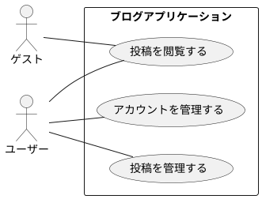
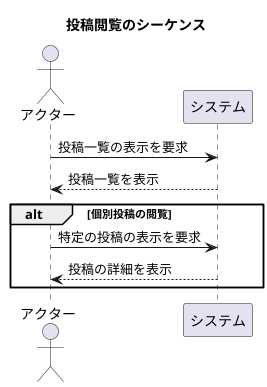
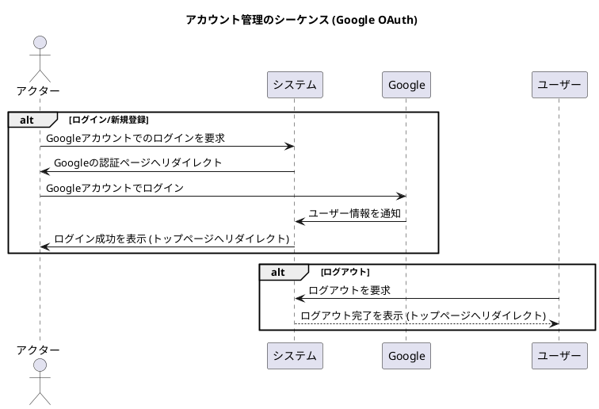
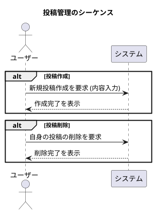

# 要求仕様書 (SPEC.md)

## 1. 概要
モダンな技術スタックを利用したサンプルとして、認証機能付きのシンプルなブログアプリケーションを構築する。

## 2. アクター
*   **ゲスト:** 認証していない匿名ユーザー
*   **ユーザー:** Googleアカウントで認証済みのユーザー

## 3. 機能要求 (FR)
*   **FR1: ユーザー認証**
    *   FR1-1: ユーザーはGoogleアカウントを利用して認証できる。
    *   FR1-2: ユーザーはログアウトできる。
*   **FR2: 投稿の管理**
    *   FR2-1: ユーザーは新しい投稿を作成できる。
    *   FR2-2: ユーザーは自分が作成した投稿を削除できる。
*   **FR3: 投稿の閲覧**
    *   FR3-1: すべてのユーザー（ゲストおよびユーザー）は、投稿の一覧を閲覧できる。
    *   FR3-2: すべてのユーザー（ゲストおよびユーザー）は、個別の投稿内容を閲覧できる。

## 4. 非機能要求 (NFR)
*   **NFR1:** `GEMINI.md`に記載された技術テーマと方針に準拠する。
*   **NFR2:** Google Cloudをデプロイ先として想定する。
*   **NFR3:** ReactおよびFirebaseは使用しない。

## 5. ユースケース図

## 6. シーケンス図

### 6.1. 投稿を閲覧する (UC_VIEW)
ゲスト、ユーザー共通のユースケースです。

### 6.2. アカウントを管理する (UC_AUTH)
Google OAuthを利用した認証とログアウトのフローです。

### 6.3. 投稿を管理する (UC_MANAGE)
認証済みユーザーの投稿作成、削除のフローです。

