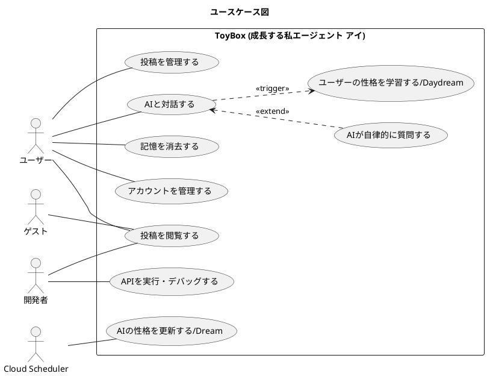
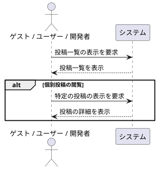
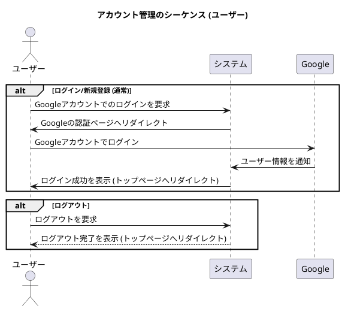
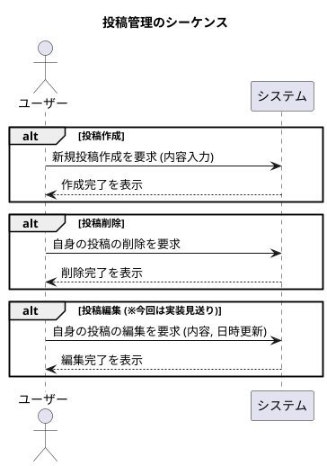
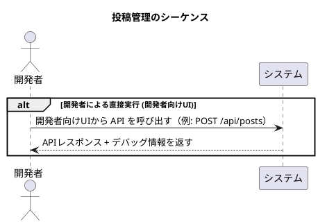
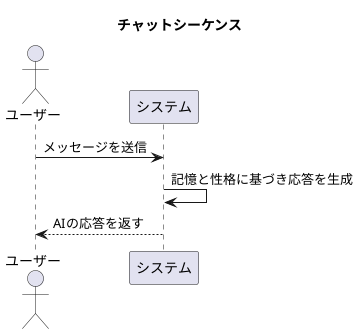
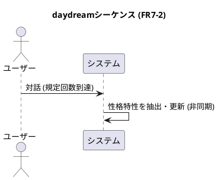
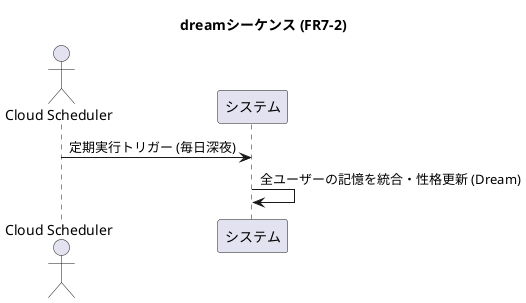
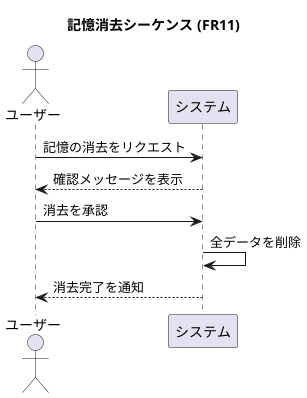
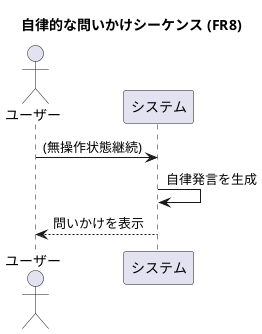

# 要求仕様書 (SPEC.md)

## 1. 概要

### プロジェクトの目標 (Goals)

このプロジェクトは、モダンで標準的な技術スタックを用いた Web アプリケーション開発のひな形となるサンプルを提供することを目的としています。
本インスタンスでは、「成長する私エージェント アイ (AI myself agent I)」として、ユーザーとの対話を通じて成長し、特徴を記憶する AI エージェント機能を実装します。

#### プロジェクトで取り上げる技術のテーマ

- クラウドサービス (Cloud Run, Cloud Tasks, Cloud Scheduler, Cloud Storage, Cloud Datastore)
- フロントエンド、バックエンド
- 生成 AI (Gemini)
- マイクロサービス
- コンテナ技術
- gRPC, REST API, Web API, HTTP/2, HTTP/3
- HTML Living Standard
- Google OAuth
- SPA
- Web コンポーネント, ES Modules
- Vue.js, Node.js
- CI, CD
- NoSQL

### プロジェクトの方針

- 個人開発者が費用面で開発を継続できるように、オープンなエコシステムをうまく活用する。
- Cloud サービスには Google Cloud を利用することを前提として設計を最適化してよいが、今後他のサービスを利用する場合にも困らないように依存関係は局所化するように設計すること。

#### 以下に述べる技術は利用禁止とする。

- React
- firebase
- JWT

## 2. アクター

- **ゲスト:** 認証していない匿名ユーザー
- **ユーザー:** Google アカウントで認証済みのユーザー
- **開発者:** 開発・テスト目的でシステムを操作する人物。
- **Cloud Scheduler:** 定期的なバッチ処理（Dream 機能など）をトリガーする外部システム。

## 3. 機能要求 (FR)

### 基本機能

- **FR1: Web UI の提供**
  - FR1-1: システムは、投稿の閲覧など複数の機能を組み合わせた、一般ユーザー向けの UI を提供する。
  - FR1-2: システムは、各 API エンドポイント（`/api/chat`, `/api/tasks/daydream`, `/api/tasks/dream` 等）を個別に実行し、動作確認ができる開発者向けの UI を提供する。
    - 開発者向け UI は、API レスポンスに含まれるデバッグ情報を画面に表示できること（NFR5 を参照）。
    - API のリクエストパラメータ（テストモードフラグ等）を画面から指定できること。
    - **[New]** 保存されたデータ (Personality Analysis 等) を閲覧し、正しく保存されているか検証できること。
    - **[New]** 開発者向け UI の各 User ID 入力フォームは、現在ログイン中のユーザー ID がデフォルトで入力された状態となること。
- **FR2: ユーザー認証**
  - FR2-1: ユーザーは Google アカウントを利用して認証できる。
  - FR2-2: ユーザーはログアウトできる。
  - FR2-3: 認証済みのユーザーは、自身のユーザー情報を取得できる。
- **FR3: 投稿の閲覧**
  - FR3-1: すべてのユーザー（ゲストおよびユーザー）は、投稿の一覧を閲覧できる。
  - FR3-2: すべてのユーザー（ゲストおよびユーザー）は、個別の投稿内容を閲覧できる。
- **FR4: 投稿の管理**
  - FR4-1: ユーザーは新しい投稿を作成できる。
  - FR4-2: ユーザーは自分が作成した投稿を削除できる。
  - FR4-3: ユーザーは自分が作成した投稿の内容および投稿日時を再編集できる。(※今回は実装見送り)
- **FR5: グリーティング機能**
  - FR5-1: システムは、名前を受け取って挨拶を返す API (`/api/greet`) を提供する。
- **FR6: システムヘルスチェック**
  - FR6-1: システムは、外部から稼働状態を確認するための API (`/api/health`) を提供する。

### AI エージェント機能 (成長する私エージェント アイ)

- **FR7: AI の成長と記憶 (旧 AI チャット機能の拡張)**
  - **FR7-1 (短期記憶):** 直近の対話履歴をコンテキストとして利用し、短期的な会話の流れや口調を応答に反映させる。
  - **FR7-2 (長期記憶の形成):** ユーザーの性格特性を長期的に学習し、AI のベースとなる性格設定を更新する。
    - **Daydream (白昼夢):** ユーザーとの対話が一定回数（例: 10 回）に達するごとに、直近の対話履歴および「これまでの想い出（投稿内容）」から性格特性を抽出・保存する。
    - **Dream (夢):** 毎日深夜（例: 0 時 UTC）に、その日の対話履歴、「これまでの想い出（投稿内容）」、および過去の分析結果を統合・要約し、AI のベース性格設定を更新する。
- **FR8: 自律的な問いかけ**
  - AI がユーザーの特徴をより深く理解するため、または会話が途切れた場合（例: 3 分間応答なし）に、自律的にユーザーの価値観や好みに関する自然な問いかけを生成する。
- **FR9: クロスデバイス記憶**
  - ユーザーがどの端末からアクセスしてもこれまでの記憶（対話履歴、性格設定）が活用できる。
- **FR10: ユーザーごとの記憶**
  - ユーザーの特徴はアクセスしているユーザー毎（Google アカウント毎）に記憶する。
- **FR11: 記憶の消去**
  - ユーザーから要求があった場合、確認後にデータベース上の当該ユーザー ID に紐づく全てのデータ（チャット履歴、性格分析結果、AI の性格設定など）を消去できる。

## 4. 非機能要求 (NFR)

- **NFR1:** `GEMINI.md`に記載された技術テーマと方針に準拠する。
- **NFR2:** Google Cloud をデプロイ先として想定する。
- **NFR3:** React および Firebase は使用しない。
- **NFR4:** ローカル環境、クラウド環境ともに開発モード中はなるべく多くのデバッグ情報を表示するようにしてください。
- **NFR5:** 開発モード時、開発者向け UI は API 実行時にバックエンドで生成されたデバッグログを画面に表示できること。
- **NFR6: 開発モードの認証**
  - 開発モードでは認証をバイパスし、モックユーザーを使用する。
- **NFR7:** (FR7 関連) ユーザーの直前の発言や会話の文脈を、AI の次の応答にリアルタイムに反映させる。
- **NFR8:** (FR7 関連) プロンプトでの対話から適宜ユーザーの特徴、個性を抽出し記憶する。

## 5. ユースケース図



## 6. シーケンス図

### 6.1. 投稿を閲覧する (UC_VIEW)

ゲスト、ユーザー、開発者共通のユースケースです。



### 6.2. アカウントを管理する (UC_AUTH)

Google OAuth を利用した認証とログアウトのフローです。



### 6.3. 投稿を管理する (UC_MANAGE)

認証済みユーザー及び開発者の投稿作成、削除のフローです。





### 6.4. AI とチャットする (UC_CHAT)

認証済みユーザーが AI と対話するフローです。



### 6.5. Daydream (FR7-2)



### 6.6. Dream (FR7-2)



### 6.7. 記憶消去 (FR11)



### 6.8. 自律的な問いかけ (FR8)

フロントエンドでユーザーの無操作状態を検知した際のフローです。



## 7. API 仕様

> [!NOTE]
> 表中の「リクエストボディ」列が「なし」となっている API は、リクエストボディを持ちません。
> パラメータが必要な場合は、URL のパス（例: `/api/posts/:id` の `:id` 部分）に含まれます。

### 7.1. 投稿 (Posts)

| 機能           | 機能要求 ID | エンドポイント          | 認証     | 認可       | リクエストボディ | 成功レスポンス                           |
| -------------- | ----------- | ----------------------- | -------- | ---------- | ---------------- | ---------------------------------------- |
| 投稿一覧の取得 | FR3-1       | `GET /api/posts`        | 不要     | -          | なし             | `200 OK`<br>下記参照                     |
| 個別投稿の取得 | FR3-2       | `GET /api/posts/:id`    | 不要     | -          | なし             | `200 OK`<br>下記参照                     |
| 投稿の作成     | FR4-1       | `POST /api/posts`       | **必要** | -          | 下記参照         | `201 Created`<br>下記参照                |
| 投稿の編集     | FR4-3       | `PUT /api/posts/:id`    | **必要** | 投稿作成者 | 下記参照         | `200 OK`<br>下記参照 (※今回は実装見送り) |
| 投稿の削除     | FR4-2       | `DELETE /api/posts/:id` | **必要** | 投稿作成者 | なし             | `204 No Content`                         |

#### 投稿一覧の取得: 成功レスポンス例

```json
[
  {
    "id": "post-id-1",
    "content": "最初の投稿です。",
    "author": {
      "id": "google-user-id-1",
      "displayName": "ユーザー名1",
      "photo": "http://.../photo.jpg"
    },
    "createdAt": "2023-10-27T12:00:00Z"
  },
  {
    "id": "post-id-2",
    "content": "二番目の投稿です。",
    "author": {
      "id": "google-user-id-2",
      "displayName": "ユーザー名2",
      "photo": "http://.../photo.jpg"
    },
    "createdAt": "2023-10-27T12:01:00Z"
  }
]
```

#### 個別投稿の取得: 成功レスポンス例

```json
{
  "id": "post-id-1",
  "content": "最初の投稿です。",
  "author": {
    "id": "google-user-id-1",
    "displayName": "ユーザー名1",
    "photo": "http://.../photo.jpg"
  },
  "createdAt": "2023-10-27T12:00:00Z"
}
```

#### 投稿の作成: リクエストボディ例

```json
{
  "content": "新しい投稿内容です。"
}
```

#### 投稿の作成: 成功レスポンス例

````json
{
  "id": "post-id-new",
  "content": "新しい投稿内容です。",
  "author": {
    "id": "google-user-id-current",
    "displayName": "現在のユーザー名",
    "photo": "http://.../photo.jpg"
  },
  "createdAt": "2023-10-27T12:02:00Z"
}

#### 投稿の編集: リクエストボディ例 (※今回は実装見送り)

```json
{
  "content": "更新された投稿内容です。",
  "createdAt": "2023-10-27T12:05:00Z"
}
````

#### 投稿の編集: 成功レスポンス例 (※今回は実装見送り)

```json
{
  "id": "post-id-1",
  "content": "更新された投稿内容です。",
  "author": {
    "id": "google-user-id-current",
    "displayName": "現在のユーザー名",
    "photo": "http://.../photo.jpg"
  },
  "createdAt": "2023-10-27T12:05:00Z"
}
```

### 7.2. ユーザー (User)

| 機能                   | 機能要求 ID | エンドポイント | 認証     | 認可 | リクエストボディ | 成功レスポンス       |
| ---------------------- | ----------- | -------------- | -------- | ---- | ---------------- | -------------------- |
| 認証ユーザー情報の取得 | FR2-3       | `GET /user`    | **必要** | -    | なし             | `200 OK`<br>下記参照 |

#### 認証ユーザー情報の取得: 成功レスポンス例

```json
{
  "provider": "google",
  "id": "123456789012345678901",
  "displayName": "ユーザー名",
  "name": {
    "familyName": "姓",
    "givenName": "名"
  },
  "emails": [
    {
      "value": "user@example.com",
      "verified": true
    }
  ],
  "photos": [
    {
      "value": "https://.../photo.jpg"
    }
  ]
}
```

### 7.3. グリーティング (Greeting)

| 機能       | 機能要求 ID | エンドポイント    | 認証                                       | 認可 | リクエストボディ | 成功レスポンス       |
| ---------- | ----------- | ----------------- | ------------------------------------------ | ---- | ---------------- | -------------------- |
| 挨拶の実行 | FR5-1       | `POST /api/greet` | **必要（ただし開発モードではバイパス可）** | -    | 下記参照         | `200 OK`<br>下記参照 |

#### 挨拶の実行: リクエストボディ例

```json
{
  "name": "World"
}
```

#### 挨拶の実行: 成功レスポンス例

```json
{
  "message": "Hello, World!"
}
```

### 7.4. システム (System)

| 機能           | 機能要求 ID | エンドポイント    | 認証 | 認可 | リクエストボディ | 成功レスポンス       |
| -------------- | ----------- | ----------------- | ---- | ---- | ---------------- | -------------------- |
| ヘルスチェック | FR6-1       | `GET /api/health` | 不要 | -    | なし             | `200 OK`<br>下記参照 |

#### ヘルスチェック: 成功レスポンス例

```json
{
  "status": "ok",
  "timestamp": "..."
}
```

### 7.5. AI チャット (AI Chat)

(既存仕様維持。ただし内部ロジックは Daydream トリガー等を含む)

| 機能        | 機能要求 ID | エンドポイント   | 認証     | 認可 | リクエストボディ | 成功レスポンス       |
| ----------- | ----------- | ---------------- | -------- | ---- | ---------------- | -------------------- |
| AI との対話 | FR7-1, FR8  | `POST /api/chat` | **必要** | -    | 下記参照         | `200 OK`<br>下記参照 |

#### AI との対話: リクエストボディ例 (通常会話)

```json
{
  "message": "こんにちは"
}
```

#### AI との対話: リクエストボディ例 (自律的な問いかけ要求)

```json
{
  "isAutoTrigger": true
  // message は省略可能、または空文字
}
```

#### AI との対話: 成功レスポンス例

```json
{
  "message": "こんにちは、何かお手伝いできますか？"
}
```

### 7.6. 記憶管理 (Memory)

| 機能       | 機能要求 ID | エンドポイント       | 認証     | 認可 | リクエストボディ | 成功レスポンス   |
| ---------- | ----------- | -------------------- | -------- | ---- | ---------------- | ---------------- |
| 記憶の消去 | FR11        | `DELETE /api/memory` | **必要** | 本人 | なし             | `204 No Content` |

### 7.7. 内部/バッチ連携 (Internal)

| 機能                | 機能要求 ID | エンドポイント             | 認証                | 認可 | リクエストボディ | 成功レスポンス |
| ------------------- | ----------- | -------------------------- | ------------------- | ---- | ---------------- | -------------- |
| Daydream タスク実行 | FR7-2       | `POST /api/tasks/daydream` | **Service Account** | -    | 下記参照         | `200 OK`       |
| Dream タスク実行    | FR7-2       | `POST /api/tasks/dream`    | **Service Account** | -    | なし             | `200 OK`       |

#### Daydream タスク実行: リクエストボディ例 (通常)

```json
{
  "userId": "google-user-id-123"
}
```

#### Daydream タスク実行: リクエストボディ例 (テストモード)

テストモードのフラグ (`isTest: true`) を指定すると、実際の AI 分析をスキップし、固定のテストデータ (`あなたはソフトウェアテストの専門用語が好きです`) を分析結果として保存します。これは開発およびデバッグ用途で使用します。

```json
{
  "userId": "google-user-id-123",
  "isTest": true
}
```

### 7.8. データ管理・デバッグ (Store/Developer)

開発者およびシステム管理用のデータ操作 API です。

| 機能                 | エンドポイント                          | 認証     | 認可       | リクエストボディ    | 成功レスポンス |
| :------------------- | :-------------------------------------- | :------- | :--------- | :------------------ | :------------- |
| ユーザー情報の保存   | `POST /api/store/users`                 | **必要** | Admin/Self | `{ user: {...} }`   | `200 OK`       |
| ユーザーデータの削除 | `DELETE /api/store/users/:userId`       | **必要** | Admin/Self | なし                | `200 OK`       |
| AI ペルソナの取得    | `GET /api/store/ai-personas/:userId`    | **必要** | Admin/Self | なし                | `200 OK`       |
| AI ペルソナの更新    | `POST /api/store/ai-personas/:userId`   | **必要** | Admin/Self | `...persona`        | `200 OK`       |
| チャット履歴の取得   | `GET /api/store/chat-messages/:userId`  | **必要** | Admin/Self | `query: { limit }`  | `200 OK`       |
| チャット履歴の保存   | `POST /api/store/chat-messages/:userId` | **必要** | Admin/Self | `{ role, content }` | `201 Created`  |
