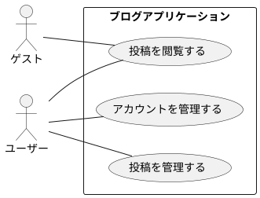
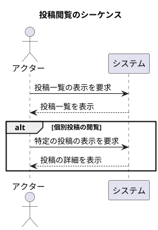
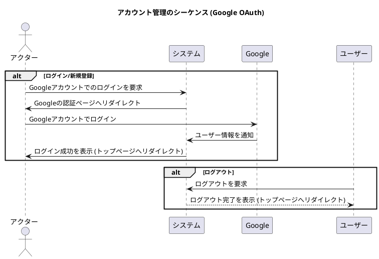

# 要求仕様書 (SPEC.md)

## 1. 概要

### プロジェクトの目標 (Goals)

このプロジェクトは、モダンで標準的な技術スタックを用いた Web アプリケーション開発のひな形となるサンプルを提供することを目的としています。

#### プロジェクトで取り上げる技術のテーマは大きく下記の技術である。

- クラウドサービス
- フロントエンド、バックエンド
- 生成 AI
- マイクロサービス
- コンテナ技術
- gRPC, REST API, Web API, HTTP/2, HTTP/3
- HTML Living Standard
- Google OAuth
- SPA
- Web コンポーネント, ES Modules
- Vue.js, Node.js
- CI, CD
- NoSQL

### プロジェクトの方針

- 個人開発者が費用面で開発を継続できるように、オープンなエコシステムをうまく活用する。
- Cloud サービスには Google Cloud を利用することを前提として設計を最適化してよいが、今後他のサービスを利用する場合にも困らないように依存関係は局所化するように設計すること

#### 以下に述べる技術は利用禁止とする。

- React
- firebase
- JWT

## 2. アクター

- **ゲスト:** 認証していない匿名ユーザー
- **ユーザー:** Google アカウントで認証済みのユーザー

## 3. 機能要求 (FR)

- **FR1: Web UIの提供**
  - FR1-1: システムは、投稿の閲覧など複数の機能を組み合わせた、一般ユーザー向けのUIを提供する。
  - FR1-2: システムは、各APIエンドポイントを個別に実行し、動作確認ができる開発者向けのUIを提供する。
- **FR2: ユーザー認証**
  - FR2-1: ユーザーは Google アカウントを利用して認証できる。
  - FR2-2: ユーザーはログアウトできる。
  - FR2-3: 認証済みのユーザーは、自身のユーザー情報を取得できる。
- **FR3: 投稿の閲覧**
  - FR3-1: すべてのユーザー（ゲストおよびユーザー）は、投稿の一覧を閲覧できる。
  - FR3-2: すべてのユーザー（ゲストおよびユーザー）は、個別の投稿内容を閲覧できる。
- **FR4: 投稿の管理**
  - FR4-1: ユーザーは新しい投稿を作成できる。
  - FR4-2: ユーザーは自分が作成した投稿を削除できる。
- **FR5: グリーティング機能**
  - FR5-1: システムは、名前を受け取って挨拶を返すAPI (`/api/greet`) を提供する。
- **FR6: システムヘルスチェック**
  - FR6-1: システムは、外部から稼働状態を確認するためのAPI (`/api/health`) を提供する。

## 4. 非機能要求 (NFR)

- **NFR1:** `GEMINI.md`に記載された技術テーマと方針に準拠する。
- **NFR2:** Google Cloud をデプロイ先として想定する。
- **NFR3:** React および Firebase は使用しない。
- **NFR4:** ローカル環境、クラウド環境ともに開発モード中はなるべく多くのデバッグ情報を表示するようにしてください。特に関数呼び出し前後には全てデバッグ用のログ機能を入れてください。 リリースモードでビルドしたときにはそれらを簡単に無効化できるようにしてください。 特に指示がない限り開発モードでビルドしてください。
- **NFR5:** 開発モード時、開発者向けUIはAPI実行時にバックエンドで生成されたデバッグログを画面に表示できること。これを実現するため、APIレスポンスにはデバッグ情報を含めることができる。

## 5. ユースケース図



## 6. シーケンス図

### 6.1. 投稿を閲覧する (UC_VIEW)

ゲスト、ユーザー共通のユースケースです。



### 6.2. アカウントを管理する (UC_AUTH)

Google OAuth を利用した認証とログアウトのフローです。



### 6.3. 投稿を管理する (UC_MANAGE)

認証済みユーザーの投稿作成、削除のフローです。


## 7. API仕様

> [!NOTE]
表中の「リクエストボディ」列が「なし」となっているAPIは、リクエストボディを持ちません。
パラメータが必要な場合は、URLのパス（例: `/api/posts/:id` の `:id` 部分）に含まれます。

### 7.1. 投稿 (Posts)

| 機能 | 機能要求ID | エンドポイント | 認証 | 認可 | リクエストボディ | 成功レスポンス |
|---|---|---|---|---|---|---|
| 投稿一覧の取得 | FR3-1 | `GET /api/posts` | 不要 | - | なし | `200 OK`<br>下記参照 |
| 個別投稿の取得 | FR3-2 | `GET /api/posts/:id` | 不要 | - | なし | `200 OK`<br>下記参照 |
| 投稿の作成 | FR4-1 | `POST /api/posts` | **必要** | - | 下記参照 | `201 Created`<br>下記参照 |
| 投稿の削除 | FR4-2 | `DELETE /api/posts/:id` | **必要** | 投稿作成者 | なし | `204 No Content` |

#### 投稿一覧の取得: 成功レスポンス例
```json
[
  {
    "id": "post-id-1",
    "content": "最初の投稿です。",
    "author": {
      "id": "google-user-id-1",
      "displayName": "ユーザー名1",
      "photo": "http://.../photo.jpg"
    },
    "createdAt": "2023-10-27T12:00:00Z"
  },
  {
    "id": "post-id-2",
    "content": "二番目の投稿です。",
    "author": {
      "id": "google-user-id-2",
      "displayName": "ユーザー名2",
      "photo": "http://.../photo.jpg"
    },
    "createdAt": "2023-10-27T12:01:00Z"
  }
]
```

#### 個別投稿の取得: 成功レスポンス例
```json
{
  "id": "post-id-1",
  "content": "最初の投稿です。",
  "author": {
    "id": "google-user-id-1",
    "displayName": "ユーザー名1",
    "photo": "http://.../photo.jpg"
  },
  "createdAt": "2023-10-27T12:00:00Z"
}
```

#### 投稿の作成: リクエストボディ例
```json
{
  "content": "新しい投稿内容です。"
}
```

#### 投稿の作成: 成功レスポンス例
```json
{
  "id": "post-id-new",
  "content": "新しい投稿内容です。",
  "author": {
    "id": "google-user-id-current",
    "displayName": "現在のユーザー名",
    "photo": "http://.../photo.jpg"
  },
  "createdAt": "2023-10-27T12:02:00Z"
}
```

### 7.2. ユーザー (User)

| 機能 | 機能要求ID | エンドポイント | 認証 | 認可 | リクエストボディ | 成功レスポンス |
|---|---|---|---|---|---|---|
| 認証ユーザー情報の取得 | FR2-3 | `GET /user` | **必要** | - | なし | `200 OK`<br>下記参照 |

#### 認証ユーザー情報の取得: 成功レスポンス例
```json
{
  "provider": "google",
  "id": "123456789012345678901",
  "displayName": "ユーザー名",
  "name": {
    "familyName": "姓",
    "givenName": "名"
  },
  "emails": [
    {
      "value": "user@example.com",
      "verified": true
    }
  ],
  "photos": [
    {
      "value": "https://.../photo.jpg"
    }
  ]
}
```

### 7.3. グリーティング (Greeting)

| 機能 | 機能要求ID | エンドポイント | 認証 | 認可 | リクエストボディ | 成功レスポンス |
|---|---|---|---|---|---|---|
| 挨拶の実行 | FR5-1 | `POST /api/greet` | **必要** | - | 下記参照 | `200 OK`<br>下記参照 |

#### 挨拶の実行: リクエストボディ例
```json
{
  "name": "World"
}
```

#### 挨拶の実行: 成功レスポンス例
```json
{
  "message": "Hello, World!"
}
```

### 7.4. システム (System)

| 機能 | 機能要求ID | エンドポイント | 認証 | 認可 | リクエストボディ | 成功レスポンス |
|---|---|---|---|---|---|---|
| ヘルスチェック | FR6-1 | `GET /api/health` | 不要 | - | なし | `200 OK`<br>下記参照 |

#### ヘルスチェック: 成功レスポンス例
```json
{
  "status": "ok",
  "timestamp": "..."
}
```
