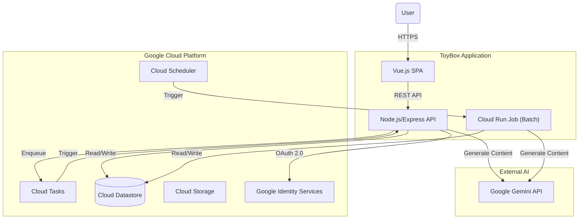
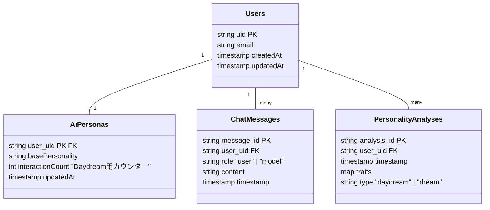

# 設計文書 (DESIGN.md)

## 1. はじめに

この文書は、`ToyBox` プロジェクトのソフトウェアアーキテクチャを arc42 テンプレートを参考にして記述したものです。

### 1.1. プロジェクトの目的

このプロジェクトは、モダンで標準的な技術スタックを用いた Web アプリケーション開発のひな形となるサンプルを提供することを目的としています。
特に「成長する私エージェント アイ」機能においては、ユーザーの性格や対話履歴を長期的に学習し、振る舞いを変化させる AI の実装例を示します。

### 1.2. 品質目標

- **保守性:** コンポーネント間の依存関係を疎に保ち、機能追加や変更が容易であること。
- **ポータビリティ:** オープンな技術を主に利用する。
- **費用対効果:** 個人開発者が低コストで運用できる構成（Google Cloud 無料枠の活用など）。
- **セキュリティ:** 一般的な Web アプリケーションに求められる基本的なセキュリティ要件を満たすこと。

## 2. 制約

- **禁止技術:** React, Firebase, JWT (Stateless auth)
- **クラウドプロバイダー:** Google Cloud を主要なターゲットとするが、強い依存は避ける。
- **開発言語:** **開発言語:** フロントエンド (Vue.js), バックエンド (Node.js)

## 3. スコープとコンテキスト

### 3.1. ビジネスコンテキスト

個人開発者や小規模チームが、モダンな Web アプリケーションを迅速にブートストラップするためのテンプレートを提供します。

特定のベンダーにロックインされる高価なサービスよりも、標準的でオープンな技術の組み合わせを優先します。これにより、個人や小規模な商用プロジェクトを開始する際の、初期開発の摩擦と運用コストを低減することがビジネス上のゴールです。

### 3.2. 技術的コンテキスト

## 4. 解決策の戦略 (Design Specifications)

- **DS01: 認証とデータ永続化**
  - ユーザー認証は、Google Identity Services (GIS) / Passport を用い、セッションベースで管理します。
  - データ永続化には NoSQL データベースである **Cloud Datastore** を使用し、ユーザーデータ、チャット履歴、性格分析結果を保存します。
- **DS02: 非同期処理とバッチ処理**
  - `daydream` (短期記憶の分析) のトリガー判定には、Datastore 上の AiPersonas.interactionCount を利用し、チャット毎にインクリメント・判定を行う。処理自体は **Cloud Tasks** にキューイングし、非同期に実行します。
  - `dream` (長期記憶の更新) は、**Cloud Scheduler** をトリガーとして **Cloud Run Job** で実行します。
- **DS03: AI モデル**
  - デフォルトの AI モデルとして **`gemini-2.5-flash-lite`** を使用します（コストと性能のバランス）。
- **DS04: フロントエンドホスティング**
  - 静的ファイルは **Cloud Storage** バケット、または Cloud Run から配信します。
- **DS05: バックエンド実装**
  - **Node.js + Express** で実装し、コンテナ化して **Cloud Run** で実行します。
- **DS06: ローカル開発**
  - **Datastore エミュレータ** を利用し、ローカルで完全な動作確認ができる環境を提供します。
- **DS07: API Gateway** (Option)
  - 必要に応じて API Gateway を導入し、エンドポイントを一元管理します。

## 5. ビルディングブロックビュー

### 5.1. コンポーネントの責務

- **Frontend (`public/`)**: Vue.js による SPA。
- **Backend**:
  - `lib/ai.js`: Gemini API との通信をカプセル化。
  - `lib/store.js` (New): Cloud Datastore へのアクセスをカプセル化。従来の `lib/posts.js` などのファイルベース処理を置き換え/統合。
  - `routes/chat.js`: AI チャットのエンドポイント。対話履歴の保存と応答生成をオーケストレーション。
  - `routes/memory.js` (New): 記憶消去などの管理エンドポイント。
  - `routes/tasks.js` (New): Cloud Tasks からのトリガーを受け取るエンドポイント。

## 6. データモデル (Schema)

Cloud Datastore を想定したデータモデルです。

## 7. デプロイメントビュー

本アプリケーションは Google Cloud のサーバーレスコンポーネントを組み合わせて構築されます。

- **コンテナ化:** `Dockerfile` を用いて、Node.js アプリケーションを内包したコンテナイメージをビルドします。Web API (Service) とバッチ処理 (Job) は同一のコードベース/イメージを共有し、エントリーポイントや環境変数で振る舞いを制御します。`Dockerfile` 内で `ENV NODE_ENV=production` を設定し、デフォルトで本番モードとして動作するようにしています。
- **CI/CD:** `cloudbuild.yaml` を使用し、Google Cloud Build でコンテナイメージのビルドと Google Artifact Registry へのプッシュ、および Cloud Run へのデプロイを自動化します。
- **実行環境 (Compute):**
  - **Cloud Run (Service):** フロントエンドおよびバックエンド API をホストします。HTTP リクエストを処理します。
  - **Cloud Run (Job):** `dream` 機能のような長時間実行されるバッチ処理を実行します。
- **非同期・スケジュール基盤:**
  - **Cloud Tasks:** `daydream` 機能のような時間のかかる性格分析処理を非同期に実行するために、リクエストをキューイングします。これにより API のレスポンスタイムを維持し、Gemini API への流量を制御します。
  - **Cloud Scheduler:** `dream` 機能のトリガーとして、毎日定刻に Cloud Run Job を起動します。

## 8. 横断的なコンセプト

### 8.1. デバッグログの転送 (Debug Log Transfer)

開発モード (`NODE_ENV !== 'production'`) で API が実行された場合、そのリクエスト処理中にバックエンドで発生したデバッグログは、レスポンスの一部としてフロントエンドに転送されます。

- **実装方針:**
  - Node.js の `AsyncLocalStorage` を利用して、リクエストごとに一意のストレージ（コンテキスト）を作成します。
  - リクエストの開始時に、ログメッセージを保持するための配列をコンテキスト内にセットするミドルウェア (`requestLogger.js`) を導入します。
  - アプリケーション内のどこからでも、現在のリクエストのコンテキストにアクセスしてログを追記できるロガーユーティリティを実装します。
  - API がレスポンスを返す直前で、コンテキストからログ配列を取得し、JSON ボディの `_debug` フィールドに挿入します。

### 8.2. 実行環境管理 (Execution Environment Management)

本アプリケーションは、`NODE_ENV` 環境変数によって制御される 2 つの主要な実行モードを持ちます。`Dockerfile` により、コンテナ環境ではデフォルトで `production` に設定されます。

- **`development` モード:**

  - 開発時のためのモードです。
  - `express-session` の `cookie.secure` が `false` に設定され、HTTP 経由でのセッションが許可されます。
  - 認証がバイパスされます。保護された API へのリクエストは、常に認証済みのモックユーザーからのものとして扱われます。
  - 詳細なデバッグログが API レスポンスに含まれます。

- **`production` モード:**
  - 本番環境のためのモードです。
  - `express-session` の `cookie.secure` が `true` に設定され、Cookie が HTTPS 経由でのみ送信されるようになります。
  - パフォーマンスとセキュリティのため、デバッグログはコンソールにも API レスポンスにも出力されません。

## 9. 設計に対する要求 (Design Requirements)

- **DR1:** 性格特性モデルとして HEXACO や Big Five を参考にする。
- **DR2:** ユーザーデータはクラウド上でアカウント毎に永続化する。
- **DR8:** UI、スタイル、ロジックを疎結合にし、保守性を高める。
- **DR10:** コード量を少なく抑え、保守性を確保する。
- **DR11:** 適切なログ出力機構を備える（既存の `logger.js` を活用）。
- **DR12:** ローカルで容易に動作確認できること。
- **DR13:** 可能な限り Google Cloud 無料枠を活用する構成。

## 10. リスクと技術的負債

- **スケーラビリティ:** 同期的な AI 処理はタイムアウトのリスクがあるため、Daydream のような分析処理は Cloud Tasks へのオフロード（DS02）によって対策する。
- **自動テスト:** バックエンドの単体・結合テスト、CI パイプラインへの組み込みが不足している（技術的負債）。今後の開発で Jest などを導入し解消する必要がある。

## 11. ブランチ戦略 (Branch Strategy)

本プロジェクトでは、シンプルさと継続的なデリバリーを重視し、**GitHub Flow** をベースとしたブランチ戦略を採用します。

### 11.1. ブランチの定義

- **`main`**:

  - 常にデプロイ可能な状態を保つメインブランチです。
  - すべての変更は Pull Request を通じてこのブランチにマージされます。
  - マージされたコードは自動的にステージング/本番環境へデプロイされるパイプライン（CI/CD）の対象となります。

- **`feature/機能名`**:

  - 新機能の開発や変更を行うための作業用ブランチです。
  - `main` ブランチから作成します。
  - 命名例: `feature/add-login`, `feature/update-ui`

- **`fix/バグ名`**:

  - バグ修正を行うための作業用ブランチです。
  - `main` ブランチから作成します。
  - 命名例: `fix/login-error`, `fix/typo-correction`

- **`docs/ドキュメント名`**:
  - ドキュメントのみの変更を行う場合の作業用ブランチです。
  - 命名例: `docs/update-readme`

### 11.2. ワークフロー

1. **Issue 作成**: 作業内容を定義する Issue を作成します。
2. **ブランチ作成**: `main` から適切なプレフィックスを持つブランチを作成します。
3. **コミット**: 変更をコミットします。コミットメッセージはわかりやすく記述します。
4. **Pull Request (PR) 作成**: 作業が完了したら、`main` への PR を作成します。
5. **レビュー**: コードレビューを行います（セルフレビュー含む）。
6. **マージ**: レビューが完了したら `main` にマージします。
7. **デプロイ**: マージをトリガーに CI/CD が走り、デプロイされます。
8. **ブランチ削除**: マージ済みの作業ブランチは削除します。
