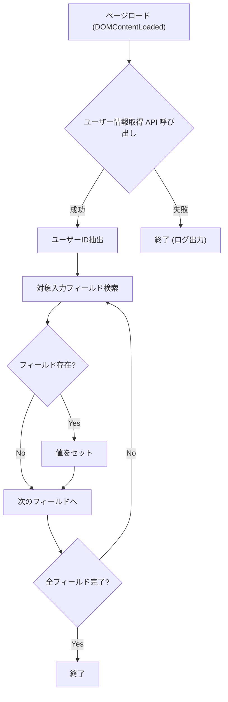

# 詳細設計書 - 開発者向け UI 改善（ユーザー ID 自動入力）

## 1. 概要

開発者向け UI (`developer.html`) にアクセスした際、現在ログイン中のユーザー ID を自動的に取得し、API テスト用の各入力フォーム (`userId` 等) にデフォルト値としてセットする機能を実装する。これにより、テスト時のコピペの手間を削減する。

## 2. 対象ファイル

- `public/developer.js` (新規機能追加)
- `public/developer.html` (既存構造の確認のみ、変更頻度は低)

## 3. UI/UX 設計

- ページロード時:
  - バックグラウンドで非同期にユーザー情報を取得。
  - 取得成功時:
    - 画面内の `id` 属性が `param-` で始まり、`-id` または `-userId` で終わる入力要素 (`input`) を検索。
    - 該当する要素に取得した `id` を `value` としてセット。
  - 取得失敗時 (未ログイン等):
    - 何もしない（空欄のまま）。エラー表示はコンソールログ程度に留める。

## 4. 処理フロー (developer.js)

## 5. 実装詳細

### 5.1. ユーザー情報取得

- エンドポイント: `GET /user`
- 解説: 既存のエンドポイントを利用。認証クッキーがあればユーザー情報を返す。

### 5.2. 自動入力ロジック

- ターゲット: `document.querySelectorAll('input[id^="param-"][id$="-id"], input[id^="param-"][id$="-userId"]')`
  - 具体的な ID 例:
    - `param-store-post-chat-id`
    - `param-store-get-chat-id`
    - `param-store-get-persona-id`
    - etc.
- 値: `user.id`

## 6. セキュリティ・制約事項

- 開発者ツールであるため、厳密なセキュリティ要件は高いわけではないが、XSS 対策として `value` プロパティへの代入を行う（`innerHTML` 等は使わない）。
