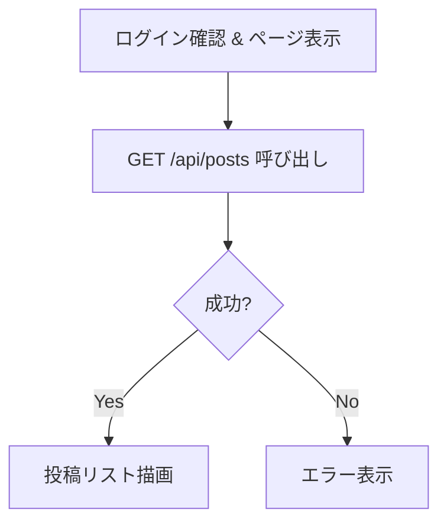
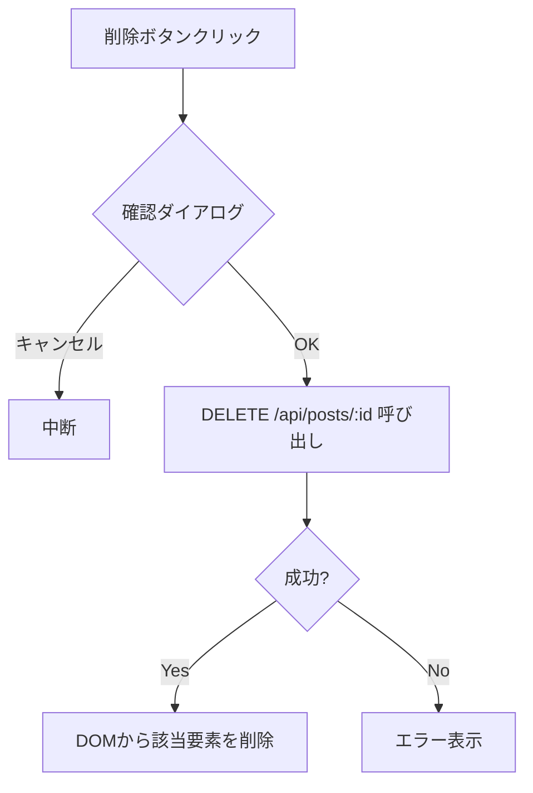

# 詳細設計書 - ユーザー投稿管理機能（一覧・削除）

## 1. 概要

一般ユーザー向けトップページ (`index.html`) において、投稿の一覧表示機能および自身の投稿を削除する機能を実装する。
※ 編集機能は今回は実装対象外とする。

## 2. 対象ファイル

- `public/index.html`: UI コンテナの追加
- `public/script.js`: ロジック実装

## 3. UI/UX 設計

- **投稿一覧表示エリア**:
  - ログイン後、`#app-section` 内に表示。
  - 各投稿はカード形式などで表示。
  - 表示項目: 投稿者アイコン/名前、投稿日時、本文、削除ボタン（自身の投稿のみ）。
- **削除フロー**:
  - 削除ボタンクリック -> 確認ダイアログ (`confirm`) -> OK -> API 呼び出し -> 成功時に一覧から削除（またはリロード）。

## 4. 処理フロー

### 4.1. 初期表示 (投稿一覧取得)

### 4.2. 投稿削除

## 5. 実装詳細

### 5.1. HTML (`public/index.html`)

- `
` を追加。
- CSS はインラインまたは `<style>` タグで最低限の見栄えを整える。

### 5.2. JavaScript (`public/script.js`)

#### `fetchPosts()`

- 非同期関数。
- `fetch('/api/posts')` を実行。

#### `renderPosts(posts, currentUser)`

- `posts` 配列をループ。
- HTML 要素を動的生成。
- `currentUser.id === post.author.id` の場合のみ「削除」ボタンを追加。
- XSS 対策: 本文 (`post.content`) は `textContent` として設定する。

#### 削除ボタンイベントハンドラ

- クリック時に `fetch('/api/posts/' + postId, { method: 'DELETE' })` を実行。
- 成功時 (`status === 204`)、`posts-container` から該当要素を削除、または `fetchPosts()` を再実行してリストを更新。

## 6. API 参照

- `GET /api/posts`: 一覧取得
- `DELETE /api/posts/:id`: 削除
- `GET /user`: 現在のユーザー情報（削除ボタンの出し分けに使用）
