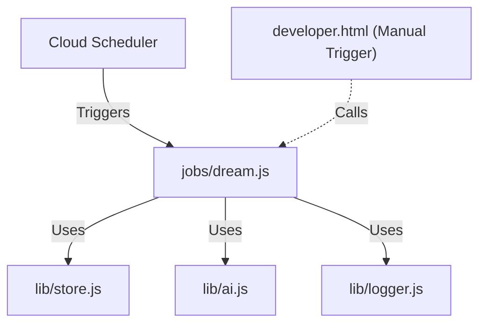

# 実装詳細: jobs/dream.js

## 概要

Cloud Scheduler から毎日深夜 (3:00 JST) にトリガーされるバッチ処理。
非同期で実行され、全ユーザー（または対象ユーザー）の分析データと会話履歴を統合し、AI ペルソナの「長期記憶 (ベース性格)」を更新する。

## 依存関係

## 主要関数

### `default async function (req, res)`

- Cloud Run Job ではなく Cloud Run Service のエンドポイント (`/api/tasks/dream`) から呼び出されるハンドラー関数を想定（ファイル構成上 `jobs/` にあるが、`routes/` から import して使用されるか、単体のスクリプトとして実行される設計）。
- **処理フロー**:
  1. ログ出力 (開始)。
  2. `store.getAllUserIdsActiveToday()` 等で対象ユーザー ID のリストを取得。
  3. ループ処理:
     - `store.getRecentAnalyses(userId)` で直近の分析結果を取得。
     - `store.getRecentChatHistory(userId)` で会話ログを取得。
     - `ai.synthesizeDream(history, analyses)` を実行 (AI による要約・性格更新)。
     - `store.updateAiPersona(userId, { basePersonality: ... })` で結果を保存。
  4. ログ出力 (終了)。
