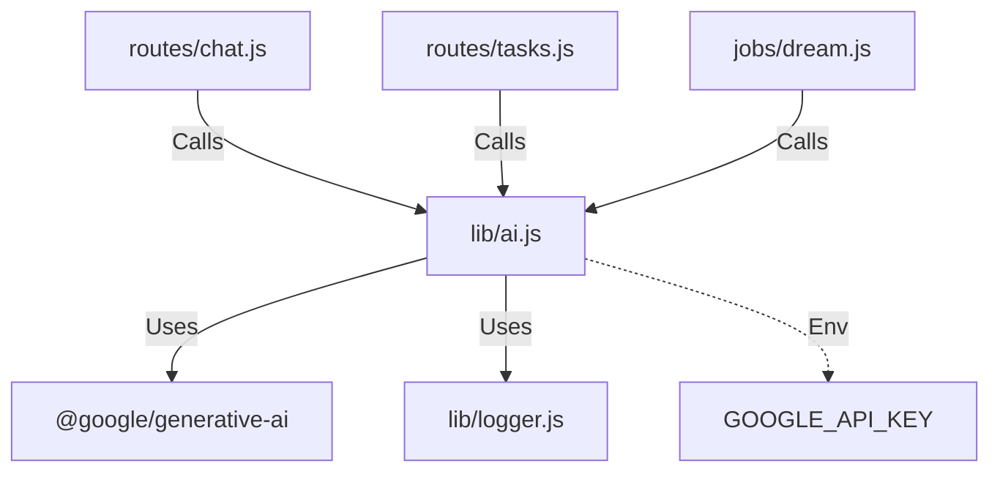

# 実装詳細: lib/ai.js

## 概要

Google Generative AI SDK を使用した AI 機能のラッパー。
テキスト生成、チャット、性格分析などの機能を提供する。

## 依存関係

## 関数詳細

### `generateResponse(history, persona)`

- **説明**: ユーザーとの対話履歴とペルソナ設定に基づいて、AI の応答を生成する。
- **引数**:
  - `history` (Array): チャット履歴オブジェクトの配列。
  - `persona` (Object): AI ペルソナ設定 (`basePersonality`, `name` 等)。
- **戻り値**: `Promise<String>`: AI が生成した応答テキスト。
- **ロジック**:
  1. `GoogleGenerativeAI` インスタンスを初期化。
  2. `systemPrompt` を構築。`persona.basePersonality` に加え、現在時刻や「あなたは〜です」といった指示を含める。
  3. `model.startChat()` でチャットセッションを開始。履歴 (`history`) を API 形式に変換して渡す。
  4. `chat.sendMessage()` で最新の入力を送信（または履歴に含まれないメッセージがあれば送信）。
  5. `response.text` プロパティ（ゲッター）経由でテキストを取得し返す。
  6. エラー時はログを出力し、デフォルトのエラーメッセージまたは空文字を返す。

### `analyzePersonality(chatHistory)`

- **説明**: チャット履歴を分析し、ユーザーの性格特性を抽出する (Daydream 用)。
- **引数**:
  - `chatHistory` (Array): 分析対象のチャット履歴。
- **戻り値**: `Promise<Object>`: 分析結果の JSON オブジェクト。
- **ロジック**:
  1. 分析用プロンプトを作成。「以下の会話からユーザーの性格、興味関心、話し方の特徴を JSON 形式で抽出してください」
  2. `model.generateContent({ contents: ... })` を実行 (配列形式の入力)。
  3. レスポンスの `response.text` プロパティからテキストを取得。
  4. JSON パースを試行。Markdown のコードブロック記法 (`json ... `) が含まれる場合は除去してパースする。
  5. パース失敗時はエラーログを出力し、`null` またはエラーオブジェクトを返す。

### `synthesizeDream(dailyHistory, pastAnalysis)`

- **説明**: 短期記憶（日次履歴）と長期記憶（過去分析）を統合し、AI の記憶（ベース性格）を更新する (Dream 用)。
- **引数**:
  - `dailyHistory` (Array): その日のチャット履歴。
  - `pastAnalysis` (Array): 過去の分析結果リスト。
- **戻り値**: `Promise<String>`: 更新された新しいベース性格 (Base Personality) プロンプト。
- **ロジック**:
  1. 統合用プロンプトを作成。「これまでの性格設定、過去の分析結果、そして本日の会話履歴を統合し、よりユーザーに深く適応した新しい性格設定テキストを作成してください」
  2. `model.generateContent` を実行。
  3. 生成されたテキストを返す。
