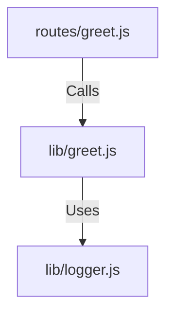

# 実装詳細: lib/greet.js

## 概要

ユーザーへの挨拶メッセージを生成するシンプルなビジネスロジック。
現在は静的なメッセージを返すが、将来的には時間帯や季節に応じたロジック拡張が想定される。

## 依存関係

## 関数詳細

### `generateGreeting(name)`

- **説明**: 指定された名前を含む挨拶メッセージを生成する。
- **引数**:
  - `name` (String): 挨拶する相手の名前（ユーザー名など）。デフォルトは "Guest"。
- **戻り値**: `String`: 生成された挨拶メッセージ。
- **ロジック**:
  1. 引数 `name` を受け取る。
  2. テンプレートリテラルで `"Hello, ${name}! Welcome to ToyBox."` を構築して返す。
