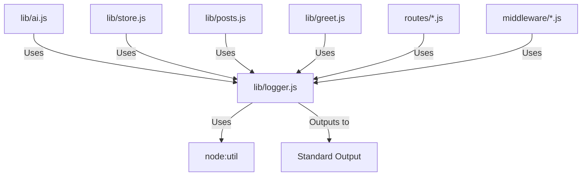

# 実装詳細: lib/logger.js

## 概要

アプリケーション全体のロギング機能を提供する。
Google Cloud Logging との互換性を考慮し、構造化ログ (JSON) を出力する。

## 依存関係

## 関数詳細

### `log(severity, functionName, message, data)`

- **説明**: 指定された重大度でログを出力する基本関数。
- **引数**:
  - `severity` (String): 'INFO', 'WARN', 'ERROR', 'DEBUG', 'NOTICE', 'CRITICAL' など。
  - `functionName` (String): 呼び出し元の関数名。トレース用。
  - `message` (String): ログメッセージ。
  - `data` (Any, Optional): 追加のデータペイロード（オブジェクト、エラー等）。
- **戻り値**: なし。
- **ロジック**:
  1. ログオブジェクト `{ severity, message, functionName, ... }` を構築する。
  2. メッセージ引数を処理:
     - 文字列以外の場合は `util.inspect` を使用して安全に文字列化する。これにより `Error` オブジェクトや循環参照を含むオブジェクトも詳細に出力可能。
  3. `JSON.stringify` して `console.log` (または severity によって `console.error`) で出力する。

### `enter(functionName, args)`

- **説明**: 関数の開始を記録する便利関数。
- **引数**:
  - `functionName` (String): 関数名。
  - `args` (Object, Optional): 関数の引数（マスクが必要な情報は除外して渡すこと）。
- **戻り値**: なし。
- **ロジック**:
  1. `log('INFO', functionName, 'Start', args)` を呼び出す。

### `exit(functionName, result)`

- **説明**: 関数の終了を記録する便利関数。
- **引数**:
  - `functionName` (String): 関数名。
  - `result` (Any, Optional): 戻り値や処理結果サマリー。
- **戻り値**: なし。
- **ロジック**:
  1. `log('INFO', functionName, 'End', result)` を呼び出す。
