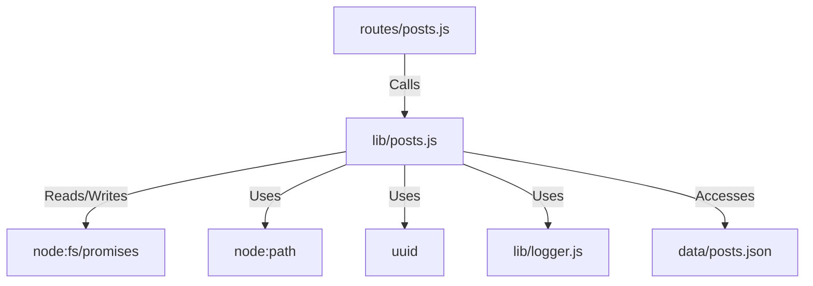

# 実装詳細: lib/posts.js

## 概要

投稿機能（掲示板）のデータを JSON ファイルベースで管理する簡易データアクセス層。
投稿の取得、作成、削除、個別取得を行う。

## 依存関係

## 関数詳細

### `getPosts()`

- **説明**: 全ての投稿データを取得する。
- **引数**: なし。
- **戻り値**: `Promise<Array>`: 投稿オブジェクトの配列。
- **ロジック**:
  1. `posts.json` を `utf8` で読み込む。
  2. `JSON.parse` して返す。
  3. ファイルが存在しない (`ENOENT`) か空の場合は空配列 `[]` を返す。
  4. その他のエラーは例外をスローする。

### `savePosts(posts)`

- **説明**: 投稿データ配列をファイルに保存する（内部関数）。
- **引数**:
  - `posts` (Array): 保存する投稿オブジェクトの配列。
- **戻り値**: `Promise<void>`
- **ロジック**:
  1. `JSON.stringify(posts, null, 2)` で整形してファイルに書き込む。

### `addPost(content, user)`

- **説明**: 新しい投稿を追加する。
- **引数**:
  - `content` (String): 投稿本文。
  - `user` (Object): 投稿者ユーザーオブジェクト (`id`, `displayName`, `photos` 等)。
- **戻り値**: `Promise<Object>`: 作成された新しい投稿オブジェクト。
- **ロジック**:
  1. `getPosts()` で既存データを取得。
  2. 新しい投稿オブジェクトを作成 (`id`: UUID, `createdAt`: 現在日時 ISO, `author`: ユーザー情報)。
  3. 配列の **先頭** に追加 (`unshift`)。
  4. `savePosts()` で保存。
  5. 作成された投稿を返す。

### `deletePost(postId, user)`

- **説明**: 指定された投稿を削除する。本人の投稿のみ削除可能。
- **引数**:
  - `postId` (String): 削除対象の投稿 ID。
  - `user` (Object): 削除を試みるユーザー。
- **戻り値**: `Promise<Boolean>`: 削除成功時 `true`、失敗時（権限なし/存在しない） `false`。
- **ロジック**:
  1. `getPosts()` で全件取得。
  2. `postId` でインデックスを検索。
  3. 見つからない場合は `false` を返す。
  4. 投稿の `author.id` と `user.id` が一致するか確認。不一致なら `false` を返す。
  5. `splice` で配列から削除。
  6. `savePosts()` で保存。
  7. `true` を返す。

### `getPostById(postId)`

- **説明**: ID 指定で投稿を 1 件取得する。
- **引数**:
  - `postId` (String): 投稿 ID。
- **戻り値**: `Promise<Object|null>`: 投稿が見つかればオブジェクト、なければ `null`。
- **ロジック**:
  1. `getPosts()` で全件取得。
  2. `find` で `id` が一致するものを探して返す。
