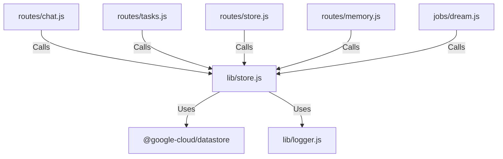

# 実装詳細: lib/store.js

## 概要

Google Cloud Datastore に対するデータ操作を一元管理する。
ユーザー、AI ペルソナ、チャット履歴、分析結果の CRUD を提供する。

## 依存関係

## 関数詳細

### `saveUser(user)`

- **説明**: ユーザー情報を保存・更新する (Upsert)。
- **引数**:
  - `user` (Object): Google Profile Object (`id`, `displayName`, `emails`, `photos`).
- **戻り値**: `Promise<void>`
- **ロジック**:
  1. `User` Kind のキー (`id`) を作成。
  2. プロファイル情報から必要なフィールド (`email`, `displayName`, `photo`, `updatedAt`) を抽出。
  3. `datastore.save` で保存。`photo` (URL) は `excludeFromIndexes` 指定。

### `getAiPersona(userId)`

- **説明**: ユーザーごとの AI ペルソナ設定を取得する。
- **引数**:
  - `userId` (String): ユーザー ID。
- **戻り値**: `Promise<Object>`: ペルソナ設定オブジェクト。
- **ロジック**:
  1. `AiPersona` Kind のキー (`userId`) で取得。
  2. 存在しない場合はデフォルト設定（`basePersonality`: "あなたは親切な AI アシスタントです。"）を返す。

### `updateAiPersona(userId, data)`

- **説明**: ペルソナ設定を更新する。
- **引数**:
  - `userId` (String): ユーザー ID。
  - `data` (Object): 更新・マージする設定値。
- **戻り値**: `Promise<void>`
- **ロジック**:
  1. 現在のデータを取得。
  2. 新しい `data` と `existing` をマージ。
  3. `updatedAt` を更新して保存。`basePersonality` は `excludeFromIndexes` 指定。

### `incrementInteractionCount(userId)`

- **説明**: ユーザーとの対話回数をインクリメントする（トランザクション処理）。
- **引数**:
  - `userId` (String): ユーザー ID。
- **戻り値**: `Promise<Number>`: 新しいカウント値。
- **ロジック**:
  1. トランザクションを開始。
  2. 現在のペルソナを取得し、カウントを確認。
  3. カウント +1 して `transaction.save`、`transaction.commit`。`basePersonality` は `excludeFromIndexes` 指定。

### `saveChatMessage(userId, role, content)`

- **説明**: チャットメッセージを保存する。
- **引数**:
  - `userId` (String): ユーザー ID。
  - `role` (String): 'user' | 'model'。
  - `content` (String): メッセージ本文。
- **戻り値**: `Promise<void>`
- **ロジック**:
  1. `ChatMessage` Kind のエンティティを作成（キーは自動生成）。
  2. `timestamp` に現在時刻を設定して保存。`content` は `excludeFromIndexes` 指定。

### `getRecentChatHistory(userId, limit)`

- **説明**: 直近のチャット履歴を取得する。
- **引数**:
  - `userId` (String): ユーザー ID。
  - `limit` (Number): 取得件数 (デフォルト 10)。
- **戻り値**: `Promise<Array>`: **古い順 (時系列)** にソートされたメッセージ配列。
- **ロジック**:
  1. `ChatMessage` を `user_uid` でフィルタ。
  2. `timestamp` の **降順** で `limit` 件取得（最新の N 件）。
  3. 取得結果を **リバース** して、古い順（会話の流れ）に戻して返す。

### `savePersonalityAnalysis(userId, traits, type)`

- **説明**: 性格分析結果を保存する。
- **引数**:
  - `userId` (String): ユーザー ID。
  - `traits` (Object/String): 分析結果データ。
  - `type` (String): 分析タイプ ('daydream' 等)。
- **戻り値**: `Promise<void>`
- **ロジック**:
  1. `PersonalityAnalysis` Kind として保存。
  2. `traits` プロパティは長文（1500 bytes 超）になる可能性があるため、`excludeFromIndexes: ['traits']` を指定してインデックスを除外する。

### `getRecentAnalyses(userId, limit)`

- **説明**: 最新の分析結果を取得する。
- **引数**:
  - `userId` (String): ユーザー ID。
  - `limit` (Number): 件数。
- **戻り値**: `Promise<Array>`: 新しい順の配列。

### `deleteUserData(userId)`

- **説明**: ユーザーに関連する全データを削除する。
- **引数**:
  - `userId` (String): 対象ユーザー ID。
- **戻り値**: `Promise<void>`
- **ロジック**:
  1. `User`, `AiPersona` はキー指定で削除。
  2. `ChatMessage`, `PersonalityAnalysis` はクエリしてキーを取得し、バッチ削除。

### `getAllUserIdsActiveToday()`

- **説明**: 処理対象の全ユーザー ID を取得する（簡易実装）。
- **引数**: なし。
- **戻り値**: `Promise<Array>`: ユーザー ID の配列。
- **ロジック**:
  1. `User` Kind をキーのみ取得するクエリを実行し、ID リストを返す。
