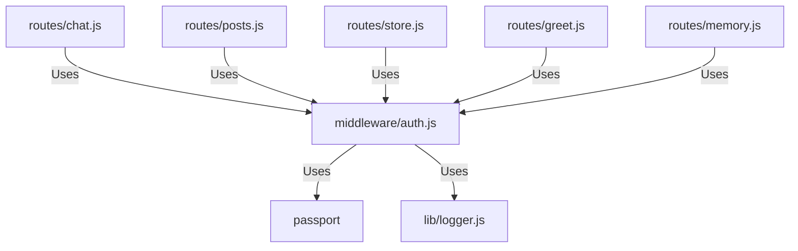

# 実装詳細: middleware/auth.js

## 概要

認証状態を確認するための Express ミドルウェア。
Passport.js のセッション認証を利用し、未認証ユーザーのリクエストを拒否する。

## 依存関係

## 関数詳細

### `isAuthenticated(req, res, next)`

- **説明**: ユーザーが認証済みかどうかを確認する。
- **引数**:
  - `req`, `res`, `next`: Express ミドルウェア標準引数。
- **動作**:
  1. `process.env.NODE_ENV` を確認。
     - **非本番 (`production` 以外)**:
       - 開発用バイパスモードとして動作。
       - `req.user` が未定義の場合、モックユーザー (ID: `mock-user-123`) を注入する。
       - `next()` を呼び出して処理を継続させる。
     - **本番 (`production`)**:
       - `req.isAuthenticated()` (Passport が付与) を呼び出す。
       - `true` の場合: `next()` を呼び出し、許可。
       - `false` の場合: `401 Unauthorized` を JSON で返し、処理を中断する。
