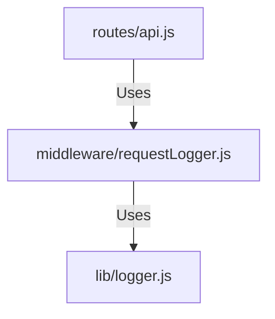

# 実装詳細: middleware/requestLogger.js

## 概要

受信した HTTP リクエストの詳細をログ出力するミドルウェア。
トラブルシューティングや監査ログとして利用される。

## 依存関係

## 関数詳細

### Default Export Function `(req, res, next)`

- **説明**: リクエスト情報をログ出力し、次の処理へ渡す。
- **引数**:
  - `req`, `res`, `next`: Express 標準。
- **動作**:
  1. `req.method` (GET, POST 等) と `req.path` (URL パス) を取得。
  2. `log('INFO', 'Request', ...)` を呼び出して出力。
  3. `data` 引数として、IP アドレス (`req.ip`), Query パラメータ (`req.query`), User Agent 等を含める。
     - _注意_: Body の内容は容量やセキュリティの観点からここでは出力しないことが多い（個別のハンドラで必要に応じてログ出力する）。
  4. `next()` を呼び出す。
