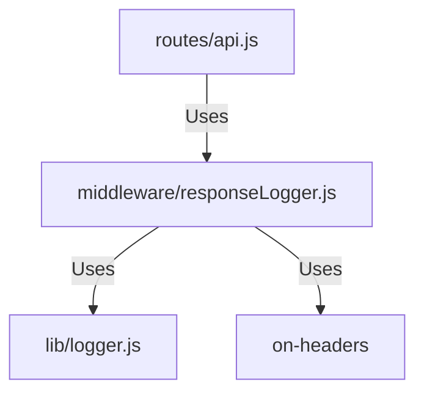

# 実装詳細: middleware/responseLogger.js

## 概要

HTTP レスポンス送信後に、ステータスコードや処理時間などをログ出力するミドルウェア。

## 依存関係

## 関数詳細

### Default Export Function `(req, res, next)`

- **説明**: レスポンス終了時 (`finish` イベント) をフックしてログを出力する。
- **引数**:
  - `req`, `res`, `next`: Express 標準。
- **動作**:
  1. タイマー開始 (または `req` に開始時刻を付与)。
  2. `res.on('finish', callback)` イベントリスナーを登録。
  3. `next()` を呼び出してアプリケーション処理を開始させる。
  4. コールバック (`finish` 発火時):
     - ステータスコード (`res.statusCode`) を取得。
     - 処理時間 (現在時刻 - 開始時刻) を計算。
     - 重大度の決定:
       - 500 以上: `ERROR`
       - 400 以上: `WARN`
       - その他: `INFO`
     - `log(severity, 'Response', ...)` で出力。
