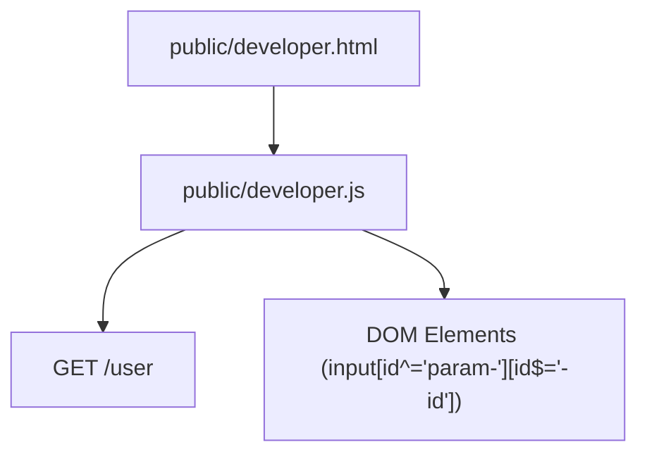

# Implementation: public/developer.js

## 概要

開発者 UI において、API 実行ヘルパー関数 `fetchApi` を提供するとともに、ページロード時に現在ログイン中のユーザー ID を取得し、入力フォームに自動入力する機能を実装する。

## 依存関係

## 実装内容

- **既存機能**: `fetchApi` 関数（変更なし）
- **新規機能**:
  - `DOMContentLoaded` イベントリスナーを追加。
  - `GET /user` を呼び出し。
  - 成功時、`id` が `param-` で始まり、かつ `-id` または `-userId` で終わる input 要素を検索。
  - 取得した `user.id` を各要素の `value` に設定。
