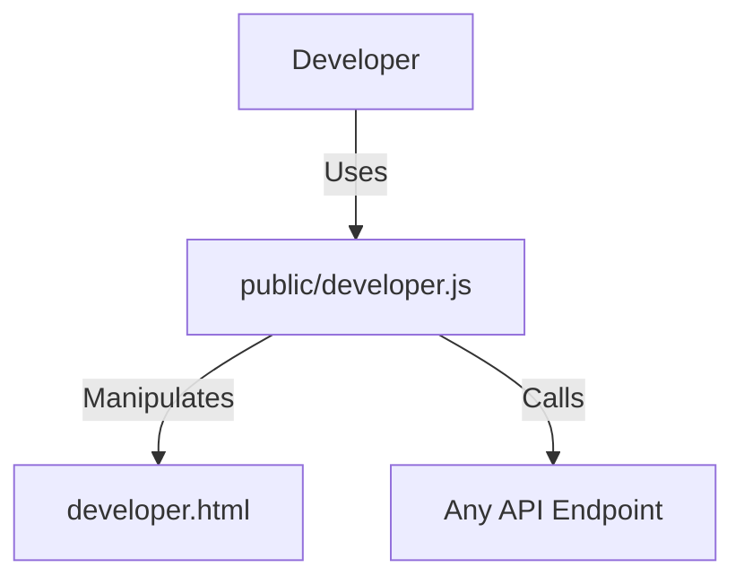

# 実装詳細: public/developer.js

## 概要

開発者用コンソール (`developer.html`) の動的な API 実行機能を制御するスクリプト。
任意の API エンドポイントに対してリクエストを送り、結果を表示する。

## 依存関係

## 関数詳細

### `fetchApi(endpointId, method, url, bodyString)`

- **説明**: 指定された API を実行し、結果を画面に表示する。
- **引数**:
  - `endpointId` (String): HTML 要素の ID 接尾辞 (例: 'posts-get-all')。結果表示先のプレエリア特定に使用。
  - `method` (String): HTTP メソッド ('GET', 'POST', 'DELETE' 等)。
  - `url` (String): リクエスト URL。
  - `bodyString` (String, Optional): JSON 形式の文字列ボディ。
- **処理**:
  1. `bodyString` があれば `JSON.parse` してオブジェクト化（パースエラー時はアラート表示して中断）。
  2. `fetch(url, options)` を実行。
     - `Content-Type: application/json` を付与。
  3. レスポンスステータスと JSON ボディを取得。
  4. 結果表示エリア (`#response-${endpointId}`) に、ステータスコードと整形された JSON をテキストとしてセットする。
  5. エラー発生時も catch してエラー内容を表示エリアに出力。
