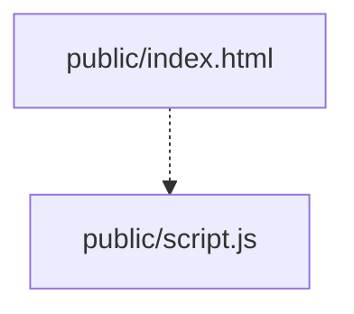

# Implementation: public/index.html

## 概要

一般ユーザー向けトップページに、投稿一覧を表示するためのコンテナ要素を追加する。

## 依存関係

## 実装内容

- **既存機能**: 挨拶、ヘルスチェック、チャット機能の UI
- **新規機能**:
  - `#app-section` 内に、投稿一覧用のセクション (`.api-section`) を追加。
  - セクション内に見出し (`h2`) "Recent Posts" を追加。
  - 投稿を格納する空のコンテナ (`div#posts-container`) を追加。
