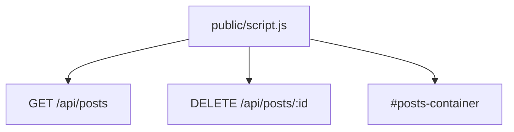

# Implementation: public/script.js

## 概要

一般ユーザー向けトップページ (`index.html`) において、投稿一覧の取得・表示および削除機能のロジックを実装する。

## 依存関係

## 実装内容

- **既存機能**: ユーザー認証チェック、挨拶、チャット、ヘルスチェック
- **新規機能**:
  - `fetchPosts()`: `GET /api/posts` を呼び出し、投稿一覧を取得。
  - `renderPosts(posts, currentUser)`: 取得した投稿を `#posts-container` に描画。
    - 各投稿に対してカード要素を作成。
    - 投稿者が現在のユーザー (`currentUser`) と一致する場合、「削除」ボタンを表示。
    - 「削除」ボタンクリック時、`DELETE /api/posts/:id` を呼び出し、成功すれば一覧を再取得。
  - `window.onload`: ユーザー情報取得後に `fetchPosts()` を呼び出すように修正。
