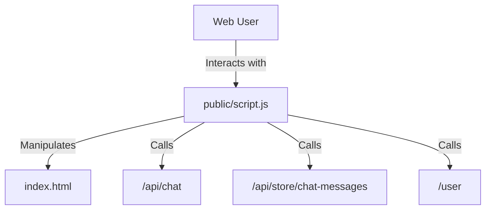

# 実装詳細: public/script.js

## 概要

メインのチャット UI (`index.html`) を制御するフロントエンドロジック。
メッセージの送信、表示、履歴の読み込みを行う。

## 依存関係

## 関数詳細

### `appendMessage(role, text)`

- **説明**: チャットウィンドウにメッセージを追加表示する。
- **引数**:
  - `role` (String): 'user' | 'model'。スタイル分けに使用。
  - `text` (String): 表示するメッセージ本文。
- **処理**:
  1. `div` 要素を作成し、クラス (`message`, `user-message`/`model-message`) を付与。
  2. テキストを設定。
  3. チャット履歴コンテナ (`#chat-history`) に追加。
  4. 最下部へスクロール。

### `loadChatHistory()` (window.onload)

- **説明**: ページ読み込み時に過去のチャット履歴を取得して表示する。
- **処理**:
  1. `GET /api/store/chat-messages/:userId` (または現在のユーザー ID を特定するエンドポイント) をコール。
     - _注意_: 現在の実装では `userId` のハードコードや、`GET /user` からの動的取得など、実装状況に合わせて調整されている。
  2. 取得した配列をループし、`appendMessage` で順次表示。

### `sendMessage()` (form.onsubmit)

- **説明**: ユーザーのメッセージを送信する。
- **処理**:
  1. 入力欄からテキストを取得。空なら何もしない。
  2. `appendMessage` で自身の発言を即時表示。
  3. `POST /api/chat` に送信 (`{ message: text }`)。
  4. レスポンス ({ message: reply }) を受け取り、`appendMessage` で AI の応答を表示。
  5. エラー時はアラート等で通知。
