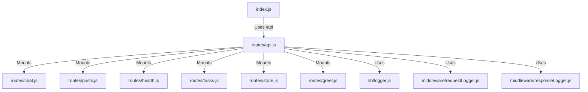

# 実装詳細: routes/api.js

## 概要

API ルートのメインエントリーポイント。
各機能モジュールのルーター (`chat`, `posts`, `health`, `tasks`, `store`, `greet`) を統合する。

## 依存関係

## 設定詳細

### Middleware Setup

- `requestLogger`: 全 API リクエストに対して事前に実行。
- `responseLogger`: 全 API レスポンス送信後に実行。

### Route Mounting

- `/health`: `healthRouter`
- `/chat`: `chatRouter`
- `/posts`: `postsRouter`
- `/tasks`: `tasksRouter`
- `/store`: `storeRouter`
- `/greet`: `greetRouter`

### 404 Handler

- 定義されたルート以外のアクセスに対し、`404 Not Found` (JSON) を返すハンドラーを末尾に配置。
