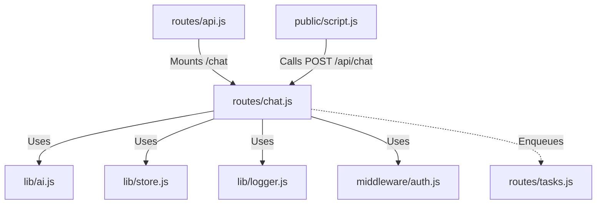

# 実装詳細: routes/chat.js

## 概要

AI チャット機能のエンドポイント。

## 依存関係

## エンドポイント詳細

### `POST /` (Root of /api/chat)

- **説明**: 自律型 AI とのチャットを行う。
- **認証**: 必須 (`isAuthenticated`)。
- **Body**: `{ message: String, isAutoTrigger: Boolean }`
- **処理フロー**:
  1. `store.getAiPersona(userId)` でペルソナを取得。
  2. `store.getRecentChatHistory(userId)` で直近履歴を取得。
  3. `ai.generateChatReply(message, history, persona, isAutoTrigger)` を呼び出し、AI の応答を生成。
  4. `store.saveChatMessage` でユーザーのメッセージを保存 (isAutoTrigger=false の場合)。
  5. `store.saveChatMessage` で AI の応答を保存。
  6. `store.incrementInteractionCount(userId)` で対話数を更新。
     - **TODO**: カウントが一定値を超えた場合に `tasks.enqueueDaydreamTask` を呼ぶロジックの追加検討 (現在は未実装または手動トリガー)。
  7. `{ message: responseText }` を JSON で返す。
  8. エラー時は 500 エラーを返す。
