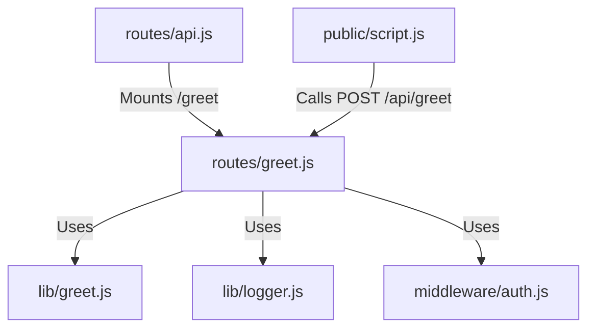

# 実装詳細: routes/greet.js

## 概要

挨拶メッセージを返すシンプルなエンドポイント。

## 依存関係

## エンドポイント詳細

### `POST /`

- **説明**: 名前を受け取り挨拶を返す。
- **認証**: 必須 (`isAuthenticated`)。
- **Body**: `{ name: String }`
- **処理フロー**:
  1. ボディから `name` を取得。なければ "Guest" とする。
  2. `greet(name)` 関数を呼び出す。
  3. `{ message: greeting }` を返す。
