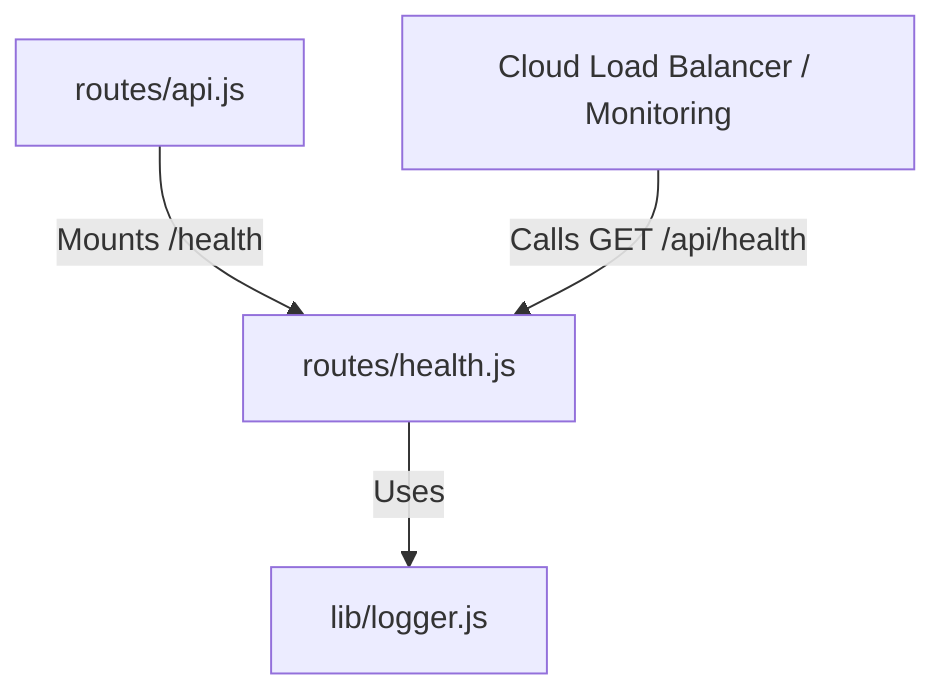

# 実装詳細: routes/health.js

## 概要

システムのヘルスチェック用エンドポイント。
ロードバランサーや監視システムからの生存確認に使用される。

## 依存関係



## エンドポイント詳細

### `GET /`

- **説明**: サーバーの稼働状態を返す。
- **認証**: 不要 (Public)。
- **Body**: なし。
- **戻り値**:
  ```json
  {
    "status": "ok",
    "timestamp": "2023-10-27T10:00:00.000Z"
  }
  ```
- **処理フロー**:
  1. 現在時刻を含むレスポンスオブジェクトを作成。
  2. ステータスコード 200 で JSON を返す。
