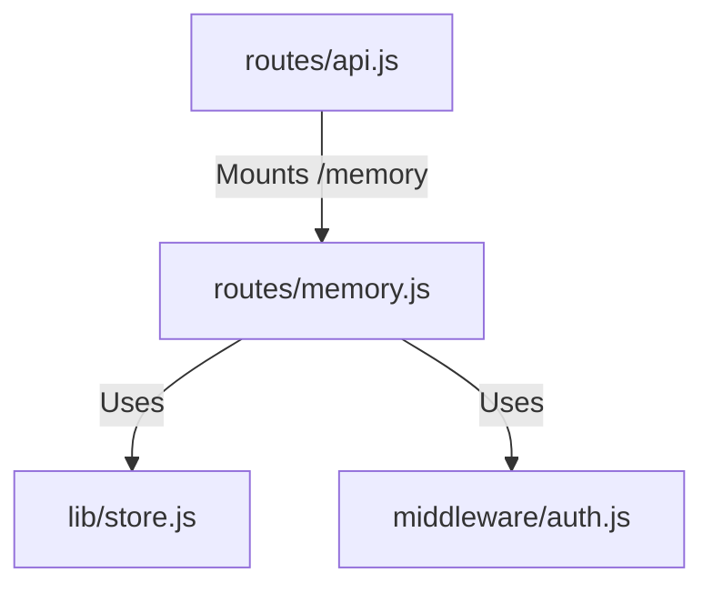

# 実装詳細: routes/memory.js

## 概要

ユーザーの「記憶」（全データ）を管理・削除するための管理エンドポイント。

## 依存関係

## エンドポイント詳細

### `DELETE /`

- **説明**: ログイン中ユーザーの全データを削除し、ログアウトする（アカウント削除）。
- **認証**: 必須。
- **処理フロー**:
  1. `store.deleteUserData(req.user.id)` を実行。
  2. セッションを破棄 (`req.logout`, `req.session.destroy`)。
  3. 204 No Content を返す。
  4. エラー時は 500 エラー。
