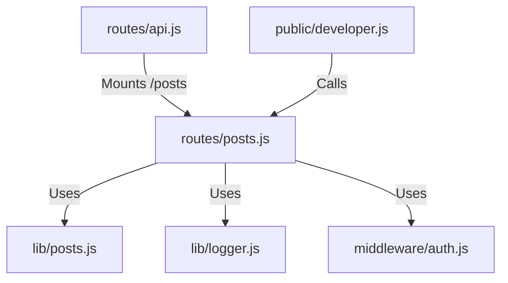

# 実装詳細: routes/posts.js

## 概要

掲示板機能（Posts）の API エンドポイント。
CRUD 操作（一覧取得、個別取得、作成、削除）を提供する。

## 依存関係

## エンドポイント詳細

### `GET /` (Public)

- **説明**: 全投稿を取得する。
- **処理フロー**:
  1. `posts.getPosts()` を呼び出す。
  2. 投稿配列を JSON で返す (200 OK)。

### `GET /:id` (Public)

- **説明**: 指定 ID の投稿を取得する。
- **処理フロー**:
  1. `posts.getPostById(req.params.id)` を呼び出す。
  2. 見つかれば JSON で返す (200 OK)。
  3. 見つからなければ 404 Not Found を返す。

### `POST /` (Auth Required)

- **説明**: 新しい投稿を作成する。
- **Body**: `{ content: String }`
- **処理フロー**:
  1. `content` がなければ 400 Bad Request。
  2. `posts.addPost(content, req.user)` を呼び出す。
  3. 作成された投稿を JSON で返す (201 Created)。

### `DELETE /:id` (Auth Required)

- **説明**: 投稿を削除する。
- **処理フロー**:
  1. `posts.deletePost(req.params.id, req.user)` を呼び出す。
  2. 成功すれば 204 No Content を返す。
  3. 失敗（権限なし含む）すれば 404 Not Found を返す（セキュリティのため理由は詳述しない）。
