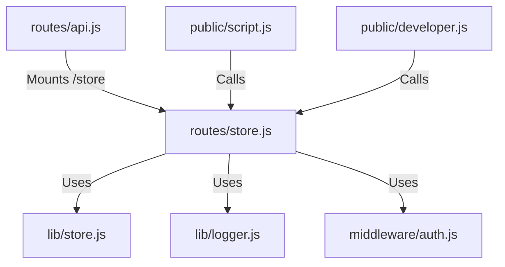

# 実装詳細: routes/store.js

## 概要

データストアへの直接的な CRUD 操作を提供する API エンドポイント群。
ユーザー、ペルソナ、チャット履歴、分析結果などのデータリソースへのアクセスを管理する。

## 依存関係

## エンドポイント

### `POST /users` (Auth Required)

- **機能**: ユーザー情報を保存する。認証済みユーザー自身の情報、または管理者による指定ユーザー情報を保存。
- **Params**: なし
- **Body**: `{ user: { id, displayName, ... } }` (Optional)

### `GET /ai-personas/:userId` (Auth Required)

- **機能**: 指定ユーザーの AI ペルソナ設定を取得する。
- **Params**: `userId`
- **Response**: `AiPersona` オブジェクト。

### `POST /ai-personas/:userId` (Auth Required)

- **機能**: 指定ユーザーの AI ペルソナ設定を更新する。
- **Params**: `userId`
- **Body**: `{ basePersonality, ... }`

### `POST /chat-messages/:userId` (Auth Required)

- **機能**: チャットメッセージを保存する。
- **Params**: `userId`
- **Body**: `{ role: "user"|"model", content: "..." }`

### `GET /analyses/:userId` (Auth Required)

- **機能**: 指定ユーザーの分析結果（PersonalityAnalysis）を取得する。
- **Params**: `userId`
- **Query**: `limit` (Default: 5)
- **Response**: `PersonalityAnalysis` の配列。

### `GET /chat-messages/:userId` (Auth Required)

- **機能**: 指定ユーザーの直近のチャット履歴を取得する。
- **Params**: `userId`
- **Query**: `limit` (Default: 10)
- **Response**: `ChatMessage` の配列。

### `DELETE /users/:userId` (Auth Required)

- **機能**: 指定ユーザーの全データを削除する。本番環境では自分自身の削除のみ許可。
- **Params**: `userId`
