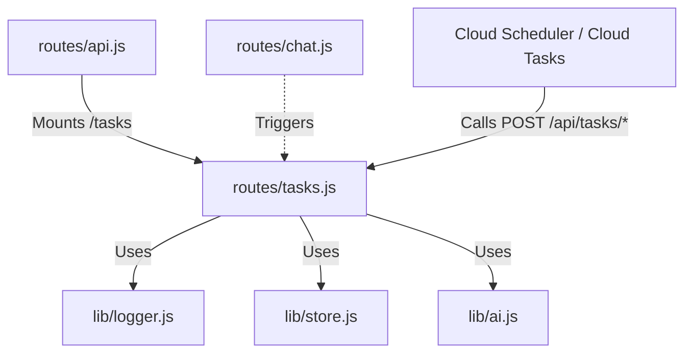

# 実装詳細: routes/tasks.js

## 概要

Google Cloud Tasks や Cloud Scheduler から呼び出される非同期タスクハンドラ。
ユーザー性格分析 (Daydream) などを実行する。
Service Account 認証または内部呼び出し制限によって保護されるべきルート。

## 依存関係



## エンドポイント詳細

### `POST /daydream`

- **説明**: ユーザーのチャット履歴を分析し、性格分析結果を保存する。
- **認証**: 本来は OIDC トークン検証が必要 (現状の実装では省略されている場合あり)。
- **Body**:
  ```json
  {
    "userId": "user-123",
    "isTest": false
  }
  ```
- **処理フロー**:
  1. `userId` がなければ 400 エラー。
  2. `isTest` が `true` の場合:
     - AI 呼び出しをスキップ。
     - 固定のモックデータを `store.savePersonalityAnalysis` で保存 (`type: 'daydream'`)。
     - 200 OK を返す。
  3. テストモードでない場合:
     - `store.getRecentChatHistory(userId, 10)` で直近 10 件の履歴を取得。
     - 履歴がなければ "No history" として終了。
     - `ai.analyzePersonality(history)` を実行。
     - 結果を `store.savePersonalityAnalysis` で保存。
     - 200 OK を返す。
  4. エラー時は 500 エラーをログ出力して返す。

### `POST /dream`

- **説明**: ユーザーの長期記憶統合（性格更新）を行う。Cloud Scheduler や開発者ツールからトリガーされる。
- **Body**:
  ```json
  {
    "userId": "user-123" // オプション。指定時はそのユーザーのみ処理。未指定時は全アクティブユーザー。
  }
  ```
- **処理フロー**:
  1. `userId`が指定されていればそのユーザー、なければ`store.getAllUserIdsActiveToday`で対象ユーザー一覧を取得。
  2. 各ユーザーについてループ処理:
     - `store.getChatHistoryForDay`で本日の会話履歴を取得。
     - `store.getRecentAnalyses`で直近の分析結果を取得。
     - `ai.synthesizePersonality`でこれらを統合し、新しい性格設定(Persona)を生成。
     - `store.updateAiPersona`で保存。
  3. 結果（処理したユーザーとステータス）を JSON で返す。
