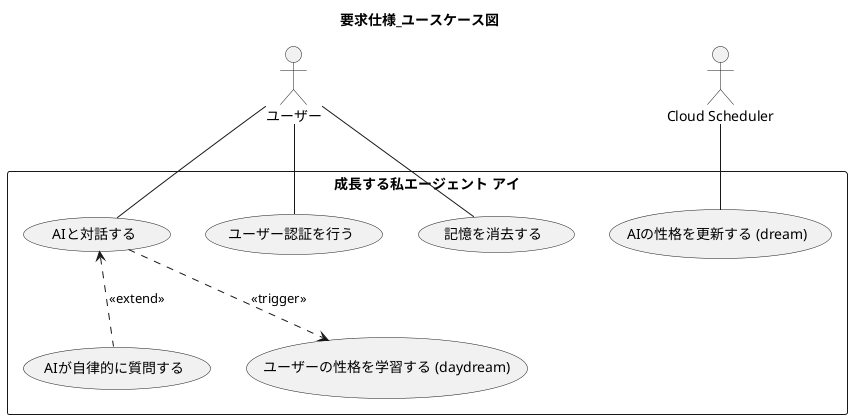
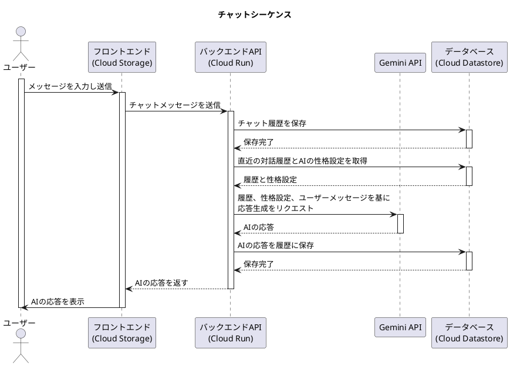
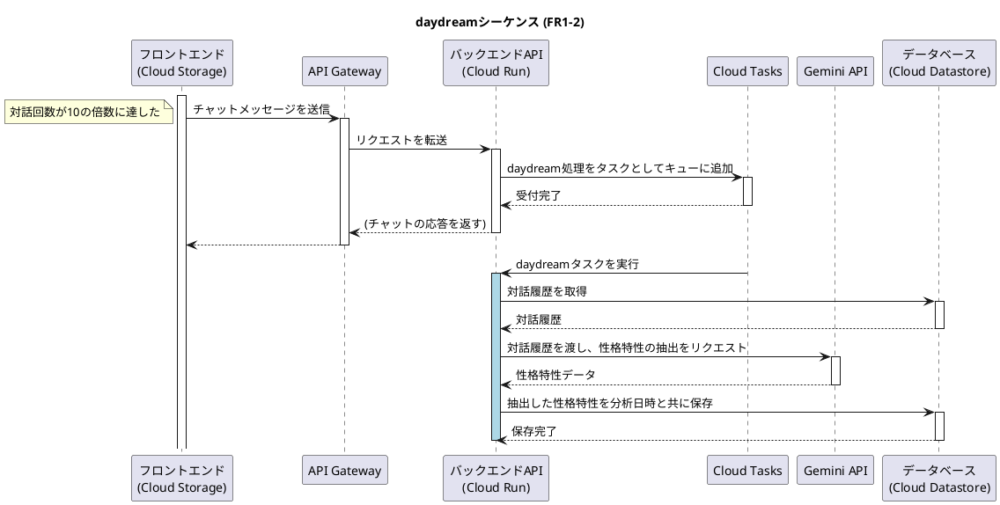
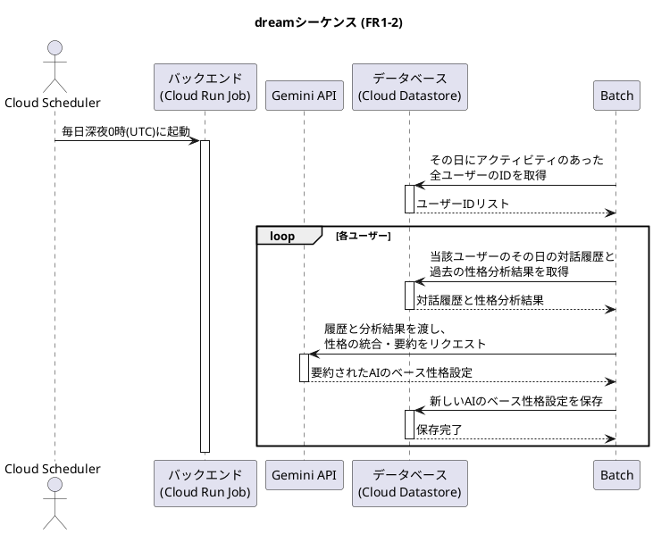
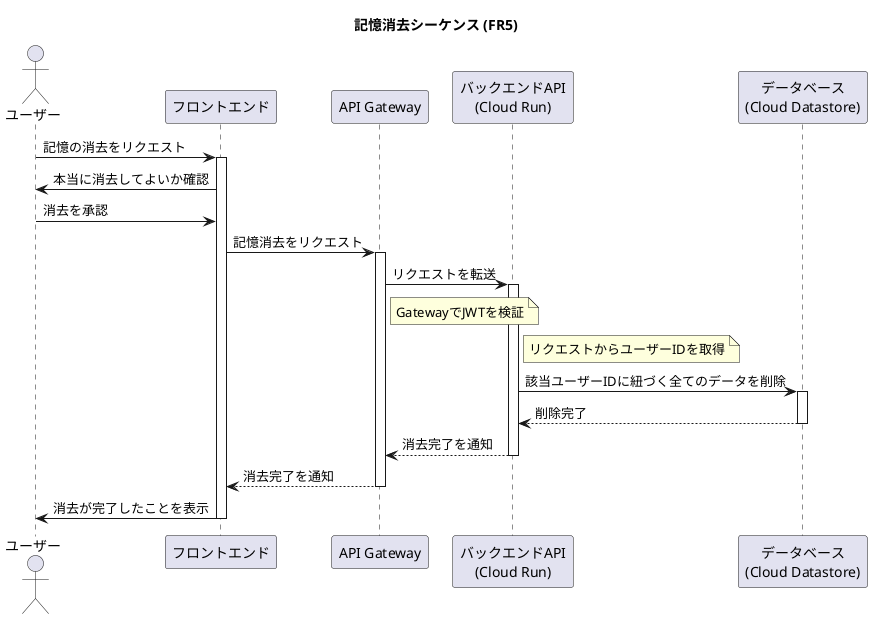
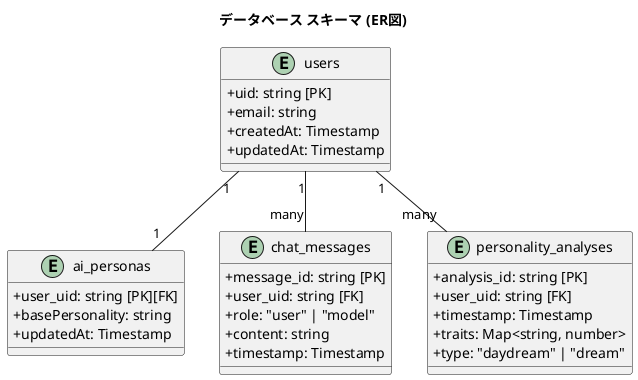

# 成長する私エージェント アイ (AI myself agent I) の仕様

このドキュメントは、「成長する私エージェント アイ」のアプリケーション仕様をまとめたものです。

## 要求仕様

### 機能要求 (Functional Requirements)

- **FR1:** ユーザーの特徴を記憶し、AI の振る舞いをユーザーに近づけます。このプロセスは「短期記憶によるリアルタイムな反応」と「長期記憶による段階的な成長」の二層アプローチによって、人間らしい自然な成長を表現します。

  - **FR1-1 (短期記憶):** 直近の対話履歴をコンテキストとして利用し、短期的な会話の流れや口調を応答に反映させます。
  - **FR1-2 (長期記憶の形成):** ユーザーの性格特性を長期的に学習し、AI のベースとなる性格設定を更新します。この処理は以下の 2 つのトリガーで非同期に実行されます。

    - **daydream トリガー:** ユーザーとの対話が 10 回に達するごとに、直近の対話履歴を分析し、ユーザーの性格特性を抽出・保存します。（人間が白昼夢を見るイメージ）
    - **dream トリガー:** 毎日深夜 0 時(UTC)に Cloud Scheduler によって起動され、その日にアクティビティがあった全ユーザーを対象に実行されます。その日の対話履歴と、過去に`daydream`や`dream`で蓄積された性格分析結果を統合・要約し、AI のベースとなる性格設定を更新します。（人間が夢を見て記憶を整理するイメージ）

      **性格設定の更新プロセス (daydream/dream 共通):**

      1. **特徴抽出:** `daydream`または`dream`トリガーで、対象の対話履歴を Gemini API に渡し、Big Five などの心理学モデルに基づきユーザーの性格特性を抽出します。
      2. **データ保存:** 抽出した性格特性を、分析日時と共にデータベースのユーザーデータ内に記録として保存します。
      3. **統合・要約:** `dream`トリガーの際、過去の分析結果も合わせて Gemini API に渡し、ユーザーの核となる性格を要約して AI のベース性格設定を更新します。

- **FR2:** AI がユーザーの特徴をより深く理解するため、または会話が途切れた場合に、自律的にユーザーの価値観や好みに関する自然な問いかけを生成してください。
  - 「会話が途切れた場合」とは、ユーザーからの最後のメッセージ送信後、一定時間（例: 3 分）応答がない状態を指します。この判定はフロントエンドのタイマーで行います。
- **FR3:** ユーザーがどの端末からアクセスしてもこれまでの記憶が活用できるようにしてください。
- **FR4:** ユーザーの特徴はアクセスしているユーザー毎（Google アカウント毎）に記憶してください。
- **FR5:** ユーザーから要求があった場合、本当に消去してよいか確認したあとに、記憶した情報を消去できるようにしてください。
  - 消去対象は、データベース上の当該ユーザー ID に紐づく全てのデータ（チャット履歴、性格分析結果、AI の性格設定など）とします。

### 非機能要求 (Non-Functional Requirements)

- **NFR1:** (**FR1-1**に関連) ユーザーの直前の発言や会話の文脈を、AI の次の応答にリアルタイムに反映させてください。
- **NFR2:** (**FR1**に関連) プロンプトでの対話から適宜ユーザーの特徴、個性を抽出し記憶してください。

### ユースケース

UML 図は下記のファイルを参照してください。(要求分析フェーズで作成)

- [要求仕様\_ユースケース図.pu](./要求仕様_ユースケース図.pu)

### 各ユースケースに対するシステムとアクター間のシーケンス図

#### シーケンス図\_チャット

#### シーケンス図\_daydream

#### シーケンス図\_dream

#### シーケンス図\_記憶消去

### アーキテクチャ

### データモデル

#### クラス図\_DB スキーマ

## 設計

### 設計に対する要求 (Design Requirements)

<!-- WHAT: 何を達成すべきか -->

- **DR1:** (**FR1**に関連) ユーザーの特徴抽出には、HEXACO や Big Five personality traits などの確立された性格特性モデルを参考にすること。
- **DR2:** (**FR3, FR4**に関連) ユーザーデータはクラウド上にアカウント毎に永続化すること。
- **DR14:** React, firebase 関連のサービスは利用しないこと。
- **DR3:** (**FR1-2**に関連) 非同期処理やバッチ処理には、適切な Google Cloud サービスを検討し、活用すること。
- **DR4:** (**FR1, FR2**に関連) Gemini API の利用時は GEMINI.md に記載されたガイドラインを遵守すること。
- **DR5:** (**FR1, FR2**に関連) デフォルトで使用する AI モデルは、コストと性能のバランスが取れたものであること。
- **DR6:** (**FR4**に関連) ユーザー認証は Google アカウントを利用した仕組みであること。
- **DR7:** フロントエンドは特定のベンダーに依存しない、標準的な Web 技術（HTML, CSS, JavaScript, Node.js）で実装すること。
- **DR8:** ソフトウェアは保守性が高く、将来の仕様変更が容易な構成であること。具体的には、UI、スタイル、ロジックが疎結合であること。
- **DR9:** コードは可読性が高く、自己説明的であること。実装意図や注意点など、コードから読み取れない情報のみをコメントとして記述すること。
- **DR10:** ソフトウェアの保守性の観点で、コードの総量を可能な限り少なく抑えること。
- **DR11:** テストやデバッグを容易にするため、適切なログ出力機構を備えること。
- **DR12:** 開発者が手元の PC で容易に動作確認できる環境を提供すること。
- **DR13:** 可能な限り Google Cloud の無料枠で動作する構成としつつ、将来的なスケールアップを見据え、サービス変更が容易な設計とすること。

### 詳細設計 (Design Specifications)

<!-- HOW: どのように実現するか -->

- **DS01 (DR2, DR6, DR14):** ユーザー認証は、フロントエンドで **Google Identity Services (GIS)** を用いて ID トークンを取得し、バックエンドの **Cloud Run** サービスでそのトークンを検証する方式を採用する。ユーザーデータおよびチャット履歴、性格分析結果などの永続化には、NoSQL データベースである **Cloud Datastore** を使用する。
- **DS02 (DR3, DR14):** `daydream`の非同期処理は、メインの API（Cloud Run）から **Cloud Tasks** に処理をキューイングし、別の Cloud Run サービスで非同期に実行する構成とする。`dream`のバッチ処理は、**Cloud Scheduler** をトリガーとして **Cloud Run ジョブ** を実行する。
- **DS03 (DR5):** デフォルトの AI モデルとして **`gemini-1.5-flash-latest`** を使用する。
- **DS04 (DR7, DR8, DR14):** **フロントエンド**は、素の**HTML, CSS, JavaScript (ES Modules)**で実装する。コードは`static`ディレクトリに配置し、ビルドされた静的ファイルは**Cloud Storage**バケットにホスティングして公開する。
- **DS05 (DR7, DR8):** **バックエンド**は、**Node.js + Express**で実装する。コードはプロジェクトルートの`server.ts`をエントリーポイントとし、コンテナ化して**Cloud Run**サービスとして実行する。
- **DS06 (DR12, DR14):** ローカル開発環境では、**Google Cloud SDK に含まれる Datastore エミュレータ**を起動し、バックエンド（`server.ts`）はローカルの Node.js 環境で直接実行する。これにより、データベースを含めた主要機能のローカルでの動作確認を可能にする。
- **DS07 (DR13):** バックエンド API のエンドポイントは **API Gateway** を通じて公開し、認証やレート制限などの管理を一元化する。

## 付帯成果物に対する要求 (Appendix Requirements)

- **ApdxR1:** 実装コード以外に下記も作成してください。
  - [ローカル環境での実行手順](./運用資料_LOCAL_DEVELOPMENT.md)
  - [Google Cloud サービスや firebase の追加設定手順](./運用資料_ADDITIONAL_SETUP.md)
  - [デプロイ手順](./運用資料_DEPLOYMENT.md)
  - [エンドユーザー向け説明書](./運用資料_USER_MANUAL.md)
